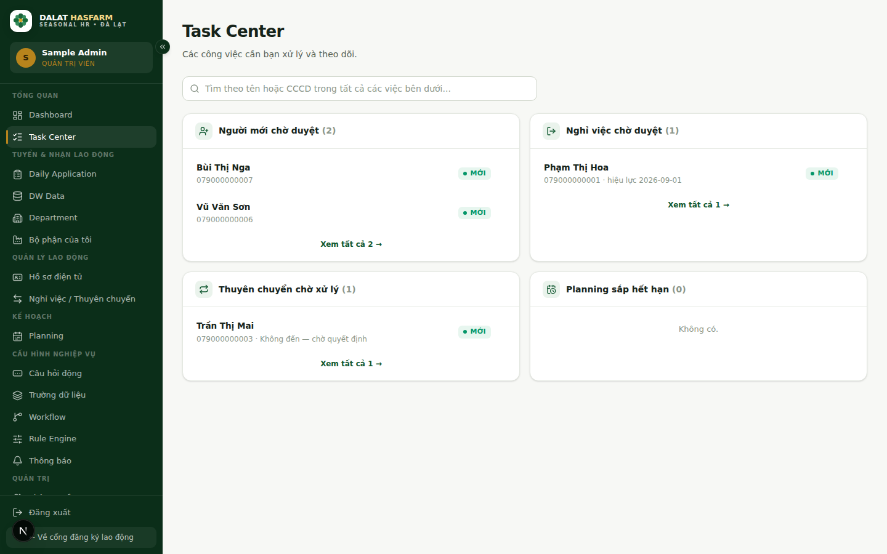
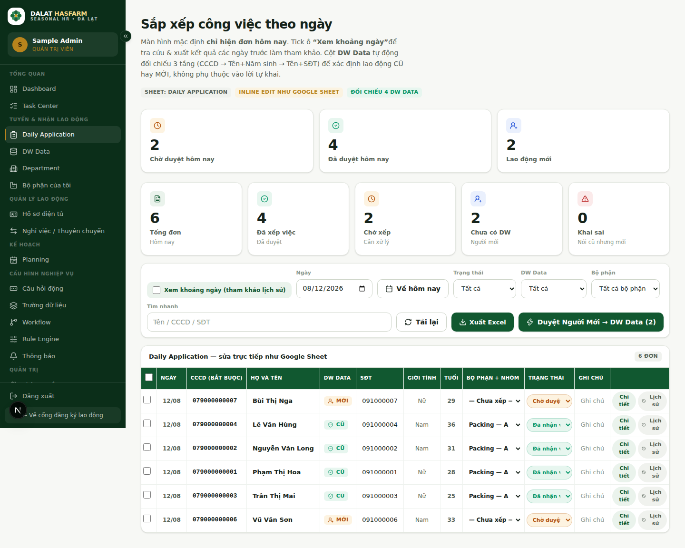

[← Mục lục](./README.md)

# Bắt đầu trong 5 phút

Mục tiêu của trang này: giúp bạn thực hiện thành công công việc đầu tiên **trước khi** đọc toàn bộ cẩm nang.

## Bước 1 — Đăng nhập

Mở địa chỉ nội bộ của hệ thống, nhập **Tên tài khoản** và **Mật khẩu** do Admin cấp, bấm **Đăng nhập**.

> **Lưu ý:** Hệ thống không có tài khoản demo sẵn trên giao diện. Nếu bạn chưa có tài khoản, liên hệ Admin để được tạo tại module *Phân quyền RBAC*.

## Bước 2 — Mở Task Center

Sau khi đăng nhập, hệ thống đưa bạn thẳng vào không gian làm việc. Việc đầu tiên nên làm mỗi ngày: bấm **Task Center** trên sidebar.

Task Center gom toàn bộ việc đang chờ bạn xử lý — hồ sơ mới, yêu cầu nghỉ việc/thuyên chuyển, planning sắp hết hạn — vào một màn hình, để bạn không phải mở lần lượt từng module để kiểm tra còn việc gì chưa xử lý.

## Bước 3 — Kiểm tra việc chờ xử lý

Mỗi thẻ trong Task Center là một nhóm việc. Số trong ngoặc là số lượng đang chờ. Bấm **"Xem tất cả →"** trên bất kỳ thẻ nào để đi thẳng tới đúng màn hình xử lý việc đó.

## Bước 4 — Mở Daily Application (nếu bạn là HR)

Nếu vai trò của bạn là HR Tuyển dụng, đây là màn hình bạn dùng nhiều nhất trong ngày: xem ai vừa đăng ký hôm nay, đối chiếu DW Data, xếp bộ phận, duyệt hồ sơ.

## Bước 5 — Xử lý task đầu tiên

Chọn một hồ sơ **Chờ duyệt**, kiểm tra thông tin, chọn **Bộ phận + Nhóm** phù hợp, đổi trạng thái sang **Đã nhận việc** (nếu nhận) hoặc **Không nhận** (nếu từ chối). Xong — bạn vừa hoàn thành thao tác nghiệp vụ đầu tiên trên hệ thống.

---

### Bạn không phải HR? Đi thẳng tới phần dành cho vai trò của bạn

- **Quản lý bộ phận** → đọc [role-manager.md](./role-manager.md) và chương [06 — Department](./06-department.md)
- **Admin** → đọc [role-admin.md](./role-admin.md) và chương [10 — Permissions & Data Scope](./10-permissions-data-scope.md)
- **Chỉ cần tra cứu kết quả đăng ký (không có tài khoản)** → đọc chương [13 — Tra cứu công khai](./13-public-lookup.md)

Muốn hiểu toàn bộ hệ thống trước khi thao tác? Đọc tiếp [01 — Giới thiệu hệ thống](./01-gioi-thieu.md).
