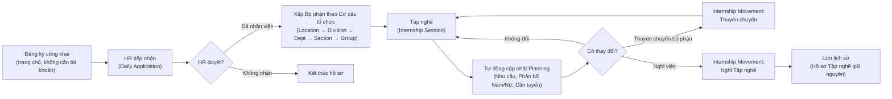

[← Mục lục](./README.md)

# 1. Giới thiệu hệ thống

## 1.1 Seasonal Worker — Hệ thống Quản trị Tập nghề Thời vụ là gì?

**Seasonal Worker** là hệ thống nội bộ giúp Dalat Hasfarm quản lý toàn bộ vòng đời của người tham gia chương trình **Tập nghề thời vụ (Internship)**: từ lúc họ đăng ký tập nghề trên trang công khai, đến khi HR duyệt và xếp bộ phận, trong suốt thời gian tập nghề, cho tới khi họ thuyên chuyển hoặc nghỉ tập nghề.

Hệ thống thay thế cho việc quản lý bằng Google Sheet rời rạc bằng một nơi duy nhất, có phân quyền rõ ràng, lưu lại lịch sử mọi thay đổi, và tự động đối chiếu để biết một người là người tập nghề **cũ** (đã từng làm) hay **mới** (lần đầu) — không phụ thuộc vào lời tự khai của người đăng ký.

## 1.2 Hệ thống dùng cho ai?

| Nhóm người dùng | Vào hệ thống bằng | Mục đích |
|---|---|---|
| Người đăng ký Tập nghề | Trang công khai (không cần tài khoản) | Đăng ký thông tin tập nghề, tra cứu kết quả xếp việc |
| HR Tuyển dụng | Tài khoản nội bộ (`ADMIN`, `HR_RECRUITER`) | Tiếp nhận hồ sơ, đối chiếu DW Data, xếp bộ phận theo cơ cấu tổ chức, quản lý Planning nhu cầu và Nghỉ việc/Thuyên chuyển |
| Quản lý bộ phận | Tài khoản nội bộ (`DEPT_MANAGER`) | Xem toàn bộ người tập nghề thuộc Data Scope được phân công tại "Bộ phận của tôi", quản lý đa chọn (multi-select), báo nghỉ việc hàng loạt |
| Quản trị viên | Tài khoản nội bộ (`ADMIN`) | Cấu hình toàn hệ thống, quản lý tài khoản và phân quyền Data Scope trên bảng gần 100 bộ phận |

## 1.3 Lợi ích chính

- **Một nơi duy nhất** — không phải tìm hồ sơ ở nhiều Sheet khác nhau.
- **Cơ cấu tổ chức chuẩn hóa** — quản lý theo 5 tầng: **Location → Division → Department → Section → Group**.
- **Đối chiếu tự động** — hệ thống tự xác định người tập nghề cũ/mới qua CCCD, tên+năm sinh, hoặc tên+số điện thoại, không phụ thuộc lời tự khai.
- **Không tạo hồ sơ trùng** — mỗi người chỉ có **1** Hồ sơ Tập nghề điện tử duy nhất (Internship Profile) dù họ quay lại tham gia bao nhiêu đợt.
- **Kế hoạch nhu cầu linh hoạt (Planning)** — cho phép nhiều kế hoạch trùng thời gian (kế hoạch gốc và các lần bổ sung), phân tách nhu cầu Nam/Nữ, tự động tính số Cần tuyển và tự động cập nhật phân bổ/nghỉ việc.
- **Phân quyền Data Scope tối ưu** — quản lý phân quyền đa bộ phận dạng bảng lớn trực quan cho gần 100 bộ phận, giao diện "Bộ phận của tôi" mở rộng toàn bộ phạm vi mặc định.
- **Có lịch sử đầy đủ** — mọi thay đổi quan trọng (duyệt hồ sơ, sửa phiên bản kế hoạch, xử lý thuyên chuyển) đều được ghi lại, không bị mất khi sửa.

## 1.4 Luồng nghiệp vụ tổng thể

Hành trình đầy đủ của một người tập nghề trong hệ thống:

Vài điểm quan trọng cần hiểu ngay từ đầu:

- **Một người = một Hồ sơ Tập nghề duy nhất.** Dù họ đăng ký lại nhiều lần qua nhiều năm, hệ thống chỉ có 1 "Internship Profile" — mỗi lần đăng ký/làm việc là 1 "Internship Session" gắn vào hồ sơ đó. Xem chi tiết ở [chương 5](./05-dw-data-worker-profile.md).
- **Đối chiếu DW Data xảy ra ngay khi đăng ký** — DW Data là kho dữ liệu đối chiếu Tập nghề và lịch sử công ty. Cột "DW Data" trên Daily Application cho biết ngay người này cũ hay mới.
- **Planning quản lý theo Nhu cầu nhân lực** — không dùng thuật ngữ Quota. Nhu cầu phân tách Nam/Nữ rõ ràng, số Cần tuyển được tính tự động theo công thức: `Cần tuyển = Nhu cầu - Phân bổ + Nghỉ việc` (clamp về 0).
- **Bộ phận của tôi mở rộng mặc định** — Quản lý bộ phận khi vào sẽ thấy toàn bộ người tập nghề thuộc tất cả bộ phận trong phạm vi Data Scope của mình, kèm tính năng chọn nhiều người (multi-select) để thao tác hàng loạt.

## 1.5 Các module chính

| Module | Ai dùng | Việc dùng để làm |
|---|---|---|
| Task Center | Cả 3 vai trò | Tổng hợp mọi việc đang chờ xử lý |
| Daily Application | ADMIN, HR_RECRUITER | Tiếp nhận & xếp việc cho người đăng ký Tập nghề hàng ngày |
| DW Data | ADMIN, HR_RECRUITER | Kho dữ liệu đối chiếu Tập nghề và lịch sử công ty |
| Hồ sơ Tập nghề (Internship Profile) | ADMIN, HR_RECRUITER | Tra cứu lịch sử các đợt tập nghề của 1 người theo CCCD |
| Cơ cấu tổ chức (Department) | ADMIN, HR_RECRUITER (quản lý toàn bộ) · DEPT_MANAGER ("Bộ phận của tôi") | Quản lý cây cơ cấu Location → Division → Department → Section → Group |
| Planning (Kế hoạch nhu cầu) | Cả 3 vai trò (xem/tạo tuỳ quyền) | Quản lý kế hoạch gốc & bổ sung, nhu cầu Nam/Nữ, phân bổ và cần tuyển |
| Nghỉ việc / Thuyên chuyển | Cả 3 vai trò (tuỳ quyền) | Xử lý Nghỉ Tập nghề & Thuyên chuyển bộ phận |
| Users, Permissions, Data Scope | ADMIN | Quản lý tài khoản và phân quyền dữ liệu theo bộ phận |
| Form Builder, Field Definitions, Workflow, Rule Engine | ADMIN (một phần mở cho HR_RECRUITER) | Cấu hình nghiệp vụ không cần sửa code |
| Import Data, Backup, Recycle Bin, Audit Log, System Control Center | ADMIN | Vận hành & bảo trì hệ thống |
| Tra cứu công khai (Lookup) | Người đăng ký (không cần tài khoản) | Kiểm tra kết quả xếp việc Tập nghề |

Tiếp theo: [02 — Đăng nhập & giao diện chung](./02-dang-nhap-giao-dien.md)
