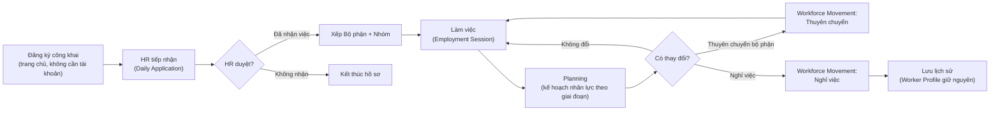

[← Mục lục](./README.md)

# 1. Giới thiệu hệ thống

## 1.1 Seasonal Worker là gì?

**Seasonal Worker** là hệ thống nội bộ giúp Dalat Hasfarm quản lý toàn bộ vòng đời của một lao động thời vụ: từ lúc họ đăng ký tập nghề trên trang công khai, đến khi HR duyệt và xếp bộ phận, trong suốt thời gian làm việc, cho tới khi họ thuyên chuyển hoặc nghỉ việc.

Hệ thống thay thế cho việc quản lý bằng Google Sheet rời rạc bằng một nơi duy nhất, có phân quyền rõ ràng, lưu lại lịch sử mọi thay đổi, và tự động đối chiếu để biết một người là lao động **cũ** (đã từng làm) hay **mới** (lần đầu) — không phụ thuộc vào lời tự khai của người đăng ký.

## 1.2 Hệ thống dùng cho ai?

| Nhóm người dùng | Vào hệ thống bằng | Mục đích |
|---|---|---|
| Người lao động thời vụ | Trang công khai (không cần tài khoản) | Đăng ký tập nghề, tra cứu kết quả xếp việc |
| HR Tuyển dụng | Tài khoản nội bộ | Duyệt hồ sơ, xếp bộ phận, quản lý Planning và Nghỉ việc/Thuyên chuyển |
| Quản đốc bộ phận | Tài khoản nội bộ | Theo dõi lao động thuộc bộ phận mình phụ trách |
| Quản trị viên | Tài khoản nội bộ | Cấu hình toàn hệ thống, quản lý tài khoản và phân quyền |

## 1.3 Lợi ích chính

- **Một nơi duy nhất** — không phải tìm hồ sơ ở nhiều Sheet khác nhau.
- **Đối chiếu tự động** — hệ thống tự xác định lao động cũ/mới qua CCCD, tên+năm sinh, hoặc tên+số điện thoại, không phụ thuộc lời tự khai.
- **Không tạo hồ sơ trùng** — mỗi người chỉ có **1** hồ sơ điện tử duy nhất (Worker Profile) dù họ quay lại làm việc bao nhiêu lần.
- **Phân quyền rõ ràng** — mỗi vai trò chỉ thấy đúng phần việc và đúng phạm vi dữ liệu của mình.
- **Có lịch sử** — mọi thay đổi quan trọng (duyệt hồ sơ, sửa kế hoạch, xử lý thuyên chuyển) đều được ghi lại, không bị mất khi sửa.

## 1.4 Luồng nghiệp vụ tổng thể

Đây là hành trình đầy đủ của một lao động thời vụ trong hệ thống:

Vài điểm quan trọng cần hiểu ngay từ đầu:

- **Một người = một hồ sơ điện tử duy nhất.** Dù họ đăng ký lại nhiều lần qua nhiều năm, hệ thống chỉ có 1 "Worker Profile" — mỗi lần đăng ký/làm việc là 1 "Employment Session" gắn vào hồ sơ đó. Xem chi tiết ở [chương 5](./05-dw-data-worker-profile.md).
- **Đối chiếu DW Data xảy ra ngay khi đăng ký** — không phải sau khi HR duyệt. Cột "DW Data" trên Daily Application cho biết ngay người này cũ hay mới.
- **Duyệt xong không có nghĩa là hết trách nhiệm** — một hồ sơ đã duyệt vẫn có thể phát sinh Thuyên chuyển hoặc Nghỉ việc sau này, và toàn bộ vẫn nằm trong cùng 1 hồ sơ điện tử.
- **Planning không bắt buộc mọi bộ phận phải dùng** — đây là công cụ theo dõi "cần bao nhiêu người trong khoảng ngày nào", tách biệt với việc duyệt hồ sơ hàng ngày.

## 1.5 Các module chính

| Module | Ai dùng | Việc dùng để làm |
|---|---|---|
| Task Center | Cả 3 vai trò | Tổng hợp mọi việc đang chờ xử lý |
| Daily Application | ADMIN, HR_RECRUITER | Tiếp nhận & duyệt hồ sơ đăng ký hàng ngày |
| DW Data | ADMIN, HR_RECRUITER | Kho dữ liệu lao động dùng để đối chiếu cũ/mới |
| Hồ sơ điện tử (Worker Profile) | ADMIN, HR_RECRUITER | Tra cứu lịch sử làm việc của 1 người theo CCCD |
| Department | ADMIN, HR_RECRUITER (quản lý toàn bộ) · DEPT_MANAGER ("Bộ phận của tôi") | Danh sách bộ phận & nhóm, lao động đang thuộc từng bộ phận |
| Planning | Cả 3 vai trò (xem/tạo tuỳ quyền) | Kế hoạch nhân lực theo giai đoạn |
| Workforce Movement | Cả 3 vai trò (tuỳ quyền) | Xử lý Nghỉ việc & Thuyên chuyển |
| Users, Permissions, Data Scope | ADMIN | Quản lý tài khoản và phân quyền |
| Form Builder, Field Definitions, Workflow, Rule Engine | ADMIN (một phần mở cho HR_RECRUITER) | Cấu hình nghiệp vụ không cần sửa code |
| Import Data, Backup, Recycle Bin, Audit Log, System Control Center | ADMIN | Vận hành & bảo trì hệ thống |
| Tra cứu công khai (Lookup) | Người lao động (không cần tài khoản) | Kiểm tra kết quả xếp việc |

Tiếp theo: [02 — Đăng nhập & giao diện chung](./02-dang-nhap-giao-dien.md)
