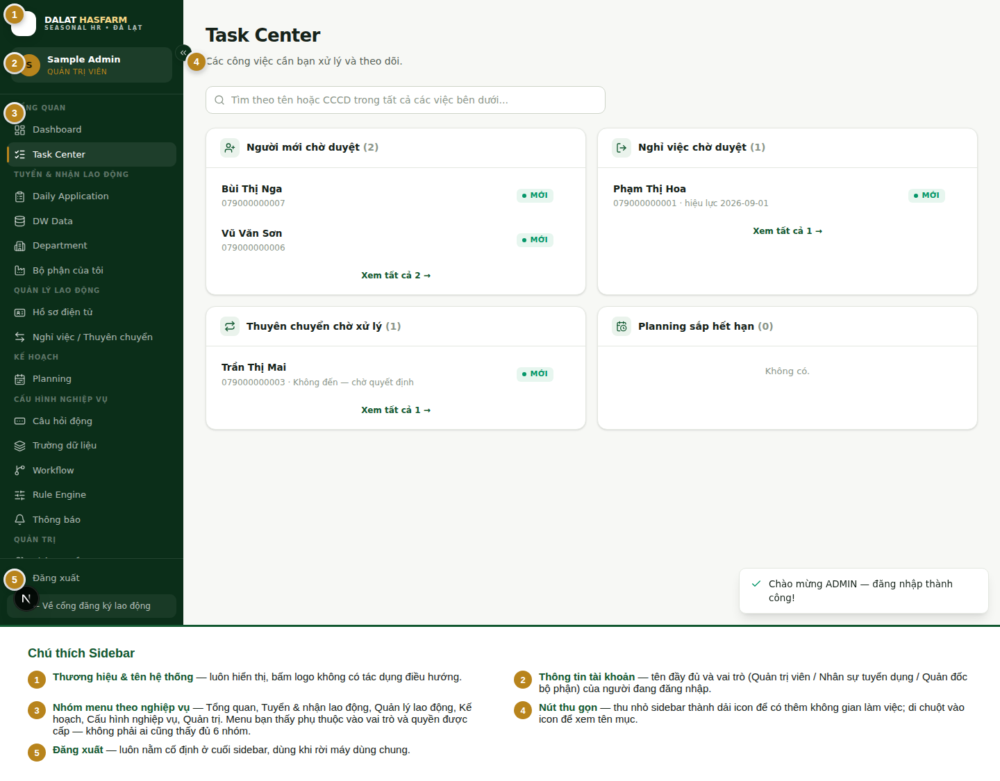

[← Mục lục](./README.md)

# 2. Đăng nhập & giao diện chung

## 2.1 Đăng nhập

1. Mở địa chỉ nội bộ của hệ thống — bạn sẽ được đưa tới trang **Đăng nhập**.
2. Nhập **Tên tài khoản**.
3. Nhập **Mật khẩu**.
4. Bấm **Đăng nhập**.

Đăng nhập thành công, hệ thống đưa bạn thẳng vào không gian làm việc phù hợp với vai trò của bạn và hiện thông báo "Chào mừng [vai trò] — đăng nhập thành công!" ở góc màn hình.

> **Quan trọng:** Không bao giờ dùng chung tài khoản với đồng nghiệp, kể cả khi cùng vai trò. Mọi thao tác (duyệt hồ sơ, tạo yêu cầu, xoá dữ liệu...) đều được ghi lại theo đúng tên tài khoản thực hiện ở Nhật ký hệ thống — dùng chung tài khoản làm mất khả năng truy vết ai đã làm gì.

### Khi đăng nhập thất bại

| Tình huống | Thông báo bạn sẽ thấy | Nguyên nhân |
|---|---|---|
| Sai tên tài khoản hoặc sai mật khẩu | *"Sai tên đăng nhập hoặc mật khẩu."* | Kiểm tra lại chính tả; Caps Lock đang bật là lỗi phổ biến nhất |
| Tài khoản đã bị Admin khoá | *"Sai tên đăng nhập hoặc mật khẩu."* (giống hệt lỗi trên) | Hệ thống **cố ý** không phân biệt hai lỗi này, để tránh lộ thông tin tài khoản nào tồn tại trong hệ thống cho người ngoài — nếu chắc chắn thông tin đúng mà vẫn không vào được, liên hệ Admin để kiểm tra |
| Nhập sai liên tục nhiều lần trong thời gian ngắn | *"Quá nhiều lần đăng nhập sai. Vui lòng thử lại sau ít phút."* | Hệ thống tạm khoá đăng nhập theo (địa chỉ mạng + tên tài khoản) sau 5 lần sai trong 15 phút, để chống dò mật khẩu. Đợi vài phút rồi thử lại |

### Đăng xuất

Bấm **Đăng xuất** ở cuối Sidebar. Luôn đăng xuất khi dùng máy tính/thiết bị dùng chung với người khác.

## 2.2 Sidebar (menu điều hướng)

Sidebar nằm bên trái màn hình (trên di động là menu ẩn — xem [chương 14](./14-mobile-guide.md)), chia thành các nhóm theo nghiệp vụ:

**Các nhóm menu:**

| Nhóm | Gồm những mục |
|---|---|
| Tổng quan | Dashboard, Task Center |
| Tuyển & nhận lao động | Daily Application, DW Data, Department, Bộ phận của tôi |
| Quản lý lao động | Hồ sơ điện tử, Nghỉ việc / Thuyên chuyển |
| Kế hoạch | Planning |
| Cấu hình nghiệp vụ | Câu hỏi động, Trường dữ liệu, Workflow, Rule Engine, Thông báo |
| Quản trị | Phân quyền RBAC, Phân quyền chi tiết, Data Scope, Control Center, Nhật ký hệ thống, Nhập dữ liệu ban đầu, Thùng rác |

> **Quan trọng:** Menu bạn nhìn thấy **phụ thuộc vào vai trò và quyền được cấp** cho tài khoản của bạn. Đây không phải lỗi hiển thị — hệ thống chủ động ẩn đi những mục bạn không có quyền dùng. Ví dụ Quản đốc bộ phận sẽ không thấy nhóm "Quản trị" hay mục "Daily Application", trong khi Admin thấy đầy đủ tất cả. Không có giả định "mọi tài khoản đều thấy như nhau".

**Thu gọn Sidebar:** bấm mũi tên nhỏ ở cạnh phải Sidebar để thu gọn thành dải icon, tăng không gian làm việc cho màn hình rộng — di chuột vào icon để xem tên đầy đủ.

## 2.3 Không có thanh điều hướng riêng ở đầu trang

Khác với một số phần mềm khác, Seasonal Worker hiện **không có** thanh header/breadcrumb cố định ở đầu trang trên desktop. Thay vào đó:

- Tên trang, mô tả ngắn và các nút hành động chính nằm ngay đầu **nội dung từng trang** (không phải một thanh riêng).
- Tên tài khoản, vai trò và nút Đăng xuất nằm cố định trong Sidebar (xem ở trên) — không có menu "hồ sơ cá nhân" (profile dropdown) riêng.
- Không có ô tìm kiếm toàn hệ thống (global search) — mỗi màn hình có ô tìm kiếm riêng cho đúng phạm vi dữ liệu của màn hình đó (ví dụ ô tìm kiếm trên Task Center chỉ tìm trong các việc đang chờ xử lý, ô tìm kiếm trên Daily Application chỉ tìm trong hồ sơ ngày đang xem).
- Trên di động, nút mở menu (☰) ở góc trên-trái đóng vai trò gần giống một thanh header — xem [chương 14](./14-mobile-guide.md).

Tiếp theo: [03 — Task Center](./03-task-center.md)
