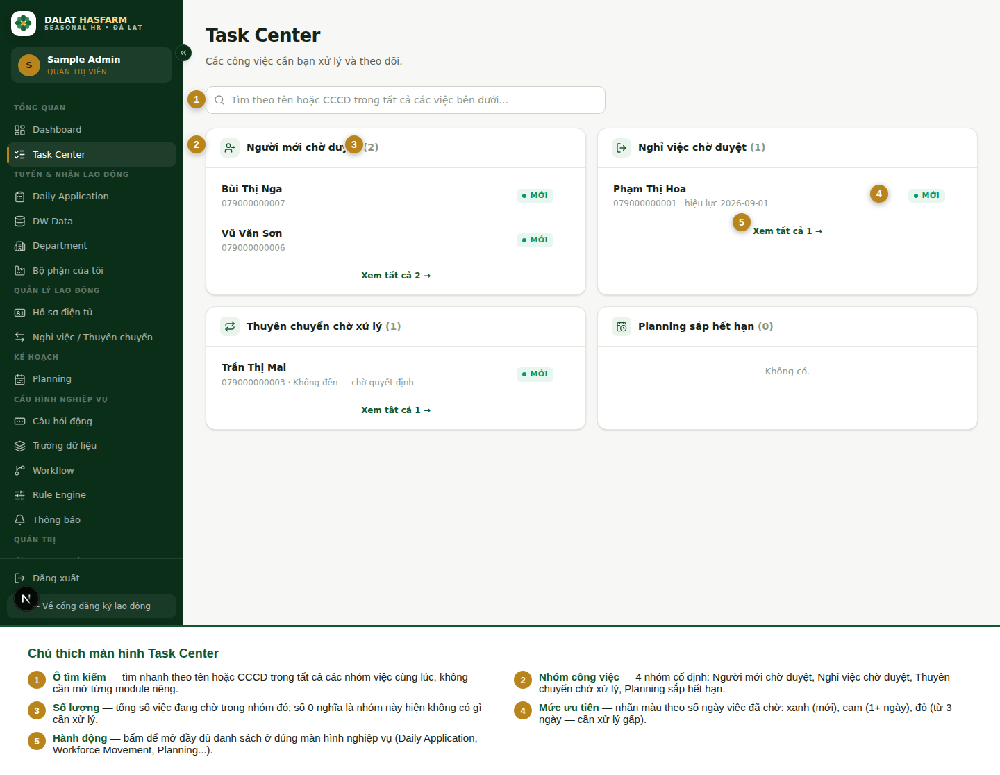

[← Mục lục](./README.md)

# 3. Task Center

> Đây là màn hình quan trọng nhất trong hệ thống. **Hãy tạo thói quen mở Task Center đầu tiên mỗi khi bắt đầu ngày làm việc.**

## 3.1 Task Center là gì?

Task Center tổng hợp **mọi việc đang chờ bạn xử lý** vào một màn hình duy nhất, thay vì bắt bạn phải tự nhớ và tự mở lần lượt từng module (Daily Application, Workforce Movement, Planning...) để kiểm tra còn việc gì tồn đọng.

## 3.2 Bốn nhóm việc

| Nhóm | Ý nghĩa | Bấm "Xem tất cả" sẽ đưa bạn tới |
|---|---|---|
| **Người mới chờ duyệt** | Hồ sơ Daily Application đang ở trạng thái Chờ duyệt | Daily Application |
| **Nghỉ việc chờ duyệt** | Yêu cầu nghỉ việc đang chờ HR xử lý (trạng thái *Chờ HR duyệt*) | Workforce Movement |
| **Thuyên chuyển chờ xử lý** | Yêu cầu thuyên chuyển đang chờ HR xác nhận **hoặc** đang chờ HR quyết định vì người lao động không đến | Workforce Movement |
| **Planning sắp hết hạn** | Kế hoạch đang **Đang áp dụng** và sẽ hết hạn trong **7 ngày tới** | Planning |

> **Lưu ý:** Yêu cầu thuyên chuyển đang ở trạng thái *Đã hoãn (chờ ngày mới)* **không** xuất hiện ở nhóm "Thuyên chuyển chờ xử lý" — vì đã có ngày hẹn mới, không cần HR xử lý thêm cho tới ngày đó. Đây là hành vi có chủ đích, không phải sai sót.

Mỗi nhóm chỉ hiện một số dòng đầu tiên (ưu tiên việc cũ nhất/gấp nhất) kèm tổng số thực tế trong ngoặc — bấm **"Xem tất cả N →"** để mở đầy đủ.

## 3.3 Tìm nhanh

Ô tìm kiếm ở đầu trang tìm theo **tên** hoặc **CCCD** trên **tất cả 4 nhóm việc cùng lúc** — không cần biết trước việc đó thuộc nhóm nào.

## 3.4 Mức ưu tiên

Mỗi việc trong nhóm "Người mới chờ duyệt", "Nghỉ việc chờ duyệt" và "Thuyên chuyển chờ xử lý" có một nhãn màu tính theo **số ngày việc đã chờ xử lý** kể từ khi phát sinh:

| Nhãn | Điều kiện | Ý nghĩa |
|---|---|---|
| 🟢 Mới | Dưới 1 ngày | Vừa phát sinh |
| 🟠 *N ngày* | 1 – 2 ngày | Đang chờ, nên xử lý sớm |
| 🔴 Ưu tiên cao — *N ngày* | Từ 3 ngày trở lên | Đã tồn đọng lâu, cần xử lý gấp |

## 3.5 Khi không có gì cần xử lý

Nếu cả 4 nhóm đều trống, Task Center hiện thông báo **"Không còn công việc cần xử lý / Bạn đã xử lý hết các task hiện tại."** — đây là trạng thái tốt, không phải lỗi.

Nếu bạn gõ từ khoá vào ô tìm kiếm mà không có kết quả, thông báo sẽ là **"Không có việc nào khớp với "[từ khoá]"."**

## 3.6 Khi có sự cố

| Thông báo | Nguyên nhân | Cách xử lý |
|---|---|---|
| *"Phiên đăng nhập đã hết hạn. Vui lòng đăng nhập lại."* | Phiên làm việc quá hạn | Bấm nút để đăng nhập lại |
| *"Tài khoản của bạn không có quyền xem Task Center."* | Quyền `dashboard.manage` (hoặc quyền tương ứng) đang bị tắt cho vai trò của bạn | Liên hệ Admin kiểm tra tại Phân quyền chi tiết |
| *"Không kết nối được máy chủ. Kiểm tra mạng và thử lại."* / *"Không thể tải dữ liệu"* | Mất mạng hoặc lỗi máy chủ tạm thời | Bấm **Thử lại** |

## 3.7 Phạm vi dữ liệu hiển thị

Task Center chỉ hiện những việc **thuộc phạm vi dữ liệu (Data Scope)** của bạn. Với Quản đốc bộ phận, chỉ những việc liên quan tới bộ phận được phân công mới xuất hiện — xem [chương 10](./10-permissions-data-scope.md).

Tiếp theo: [04 — Daily Application](./04-daily-application.md)
