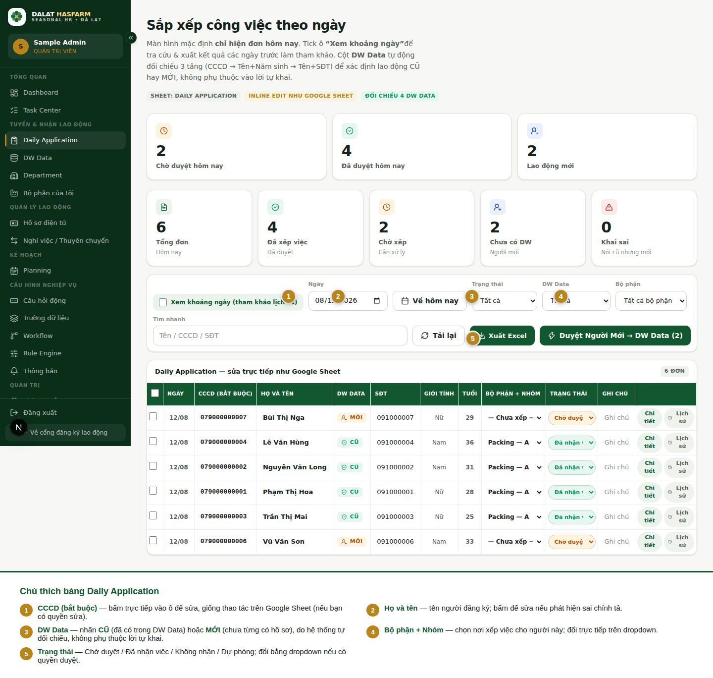

[← Mục lục](./README.md)

# 4. Daily Application

**Ai dùng:** `ADMIN`, `HR_RECRUITER`. Đây là màn hình HR dùng nhiều nhất trong ngày.

## 4.1 Mở Daily Application

Vào Sidebar → nhóm **Tuyển & nhận lao động** → **Daily Application**.

Mặc định màn hình **chỉ hiện đơn đăng ký của hôm nay** để gọn gàng, dễ xử lý trong ngày.

## 4.2 Chọn ngày / xem khoảng ngày

Tick vào ô **"Xem khoảng ngày"** để chọn khoảng "Từ ngày – Đến ngày" và tra cứu lại các đơn ngày trước (chỉ để tham khảo — không nên duyệt hồ sơ của ngày cũ). Bỏ tick để quay về chế độ mặc định "chỉ hôm nay", hoặc bấm **"Về hôm nay"**.

## 4.3 Tìm ứng viên / lao động

Dùng ô **"Tìm nhanh"** — mặc định tìm theo Tên, CCCD, SĐT. Admin có thể mở rộng danh sách cột được phép tìm tại [Trường dữ liệu (Metadata)](./09-admin-modules.md#trường-dữ-liệu-metadata).

Ngoài ra có thể lọc theo **Trạng thái**, **DW Data** (Cũ/Mới), và **Bộ phận**.

## 4.4 Đọc bảng dữ liệu

| Cột | Ý nghĩa |
|---|---|
| CCCD (bắt buộc) | Số CCCD người đăng ký khai — bắt buộc phải có |
| Họ và tên | Tên đầy đủ |
| **DW Data** | Nhãn **CŨ** (đã có trong DW Data) hoặc **MỚI** (chưa từng có hồ sơ) — do hệ thống **tự động đối chiếu**, không phụ thuộc lời tự khai của người đăng ký. Dấu cảnh báo (⚠) xuất hiện khi người đăng ký **tự khai là đã từng làm** nhưng hệ thống không tìm thấy họ trong DW Data — cần kiểm tra kỹ trường hợp này |
| SĐT, Giới tính, Tuổi | Thông tin cá nhân người đăng ký khai |
| Bộ phận + Nhóm | Nơi dự kiến xếp việc — chọn qua dropdown |
| Trạng thái | Xem bảng trạng thái bên dưới |
| Ghi chú | Ghi chú nội bộ của HR về hồ sơ này |

Nếu bạn có quyền sửa (`registrations.edit`), hầu hết các ô có thể **bấm trực tiếp để sửa** giống thao tác trên Google Sheet — gõ xong bấm Enter hoặc bấm ra ngoài ô để lưu.

> **Lưu ý về CCCD/SĐT/Địa chỉ:** Trên màn hình nội bộ này, CCCD/SĐT hiển thị đầy đủ cho người có quyền xem hồ sơ (đúng như dữ liệu người đăng ký khai) — việc **che (mask) thông tin** chỉ áp dụng khi **xuất Excel**, tuỳ theo quyền `privacy.view_cccd` / `privacy.view_phone` / `privacy.view_address` của từng vai trò. Xem [chương 11](./11-import-export.md#che-thông-tin-cá-nhân-khi-xuất-excel).

## 4.5 Các trạng thái

| Trạng thái | Ý nghĩa | Ai xử lý |
|---|---|---|
| **Chờ duyệt** | Vừa đăng ký, chưa được HR xử lý | HR |
| **Đã nhận việc** | HR đã duyệt, người này được nhận vào làm | HR |
| **Không nhận** | HR từ chối hồ sơ | HR |
| **Dự phòng** | Đưa vào danh sách dự phòng, chưa xếp việc ngay | HR |

Đổi trạng thái bằng dropdown trên cột Trạng thái (nếu có quyền `registrations.approve`).

> **Quan trọng:** Khi bạn duyệt một hồ sơ đang gắn nhãn **MỚI** vào một bộ phận (qua nút "Duyệt Người Mới → DW Data" bên dưới), hệ thống sẽ **tự động thêm họ vào DW Data** và đổi nhãn hồ sơ đó từ MỚI sang **CŨ** — vì từ giờ trở đi họ chính thức có trong kho dữ liệu gốc. Đây là hành vi đúng, không phải lỗi hiển thị.

## 4.6 Duyệt hàng loạt người mới → DW Data

Nút **"Duyệt Người Mới → DW Data (N)"** mở hộp thoại liệt kê tất cả người đang gắn nhãn MỚI trong ngày, cho phép:
- Tick chọn từng người, hoặc **Chọn tất cả**.
- Chọn **1 bộ phận chung** để xếp cả nhóm cùng lúc (tuỳ chọn — để trống nếu muốn giữ nguyên bộ phận đã xếp riêng cho từng người).
- Bấm **Xác nhận Import** — hệ thống duyệt tất cả, thêm vào DW Data, và báo kết quả (số đã duyệt / số đã thêm DW Data / số không thành công kèm lý do).

Có thể chọn nhiều hồ sơ bất kỳ (không riêng nhóm "người mới") ở bảng chính rồi dùng hai nút **"Duyệt & Nhập DW Data"** / **"Từ chối"** xuất hiện khi có hồ sơ được tick chọn.

> **Quan trọng:** Giới hạn tối đa **500 hồ sơ mỗi lần** duyệt hàng loạt.

## 4.7 Xem chi tiết & lịch sử chỉnh sửa

- Nút **"Chi tiết"** mở đầy đủ thông tin hồ sơ, bao gồm kết quả đối chiếu DW Data và các câu trả lời khảo sát (nếu có).
- Nút **"Lịch sử"** hiện toàn bộ các lần chỉnh sửa hồ sơ này — ai sửa, sửa gì, khi nào. Nếu bạn có quyền, có thể **khôi phục về phiên bản trước** ngay từ đây.

## 4.8 Xuất Excel

Bấm **"Xuất Excel"** để tải dữ liệu ra file, theo **khoảng ngày** và **bộ phận** đang chọn trên màn hình.

> **Lưu ý:** File xuất ra theo đúng **khoảng ngày** và **bộ phận** đang lọc — nhưng **không** áp dụng thêm bộ lọc Trạng thái/DW Data hay từ khoá đang gõ ở ô Tìm nhanh. Ví dụ nếu bạn đang lọc "Trạng thái = Chờ duyệt" để xem trên màn hình, file xuất ra vẫn có đủ mọi trạng thái trong đúng khoảng ngày + bộ phận đó, không chỉ riêng "Chờ duyệt".

Xem quy tắc che thông tin cá nhân ở [chương 11](./11-import-export.md).

Tiếp theo: [05 — DW Data / Worker Profile](./05-dw-data-worker-profile.md)
