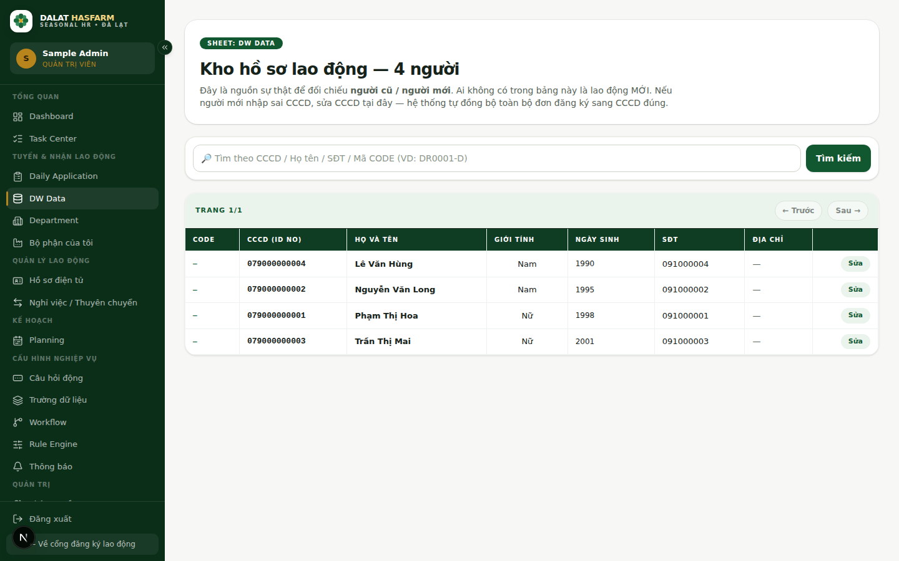
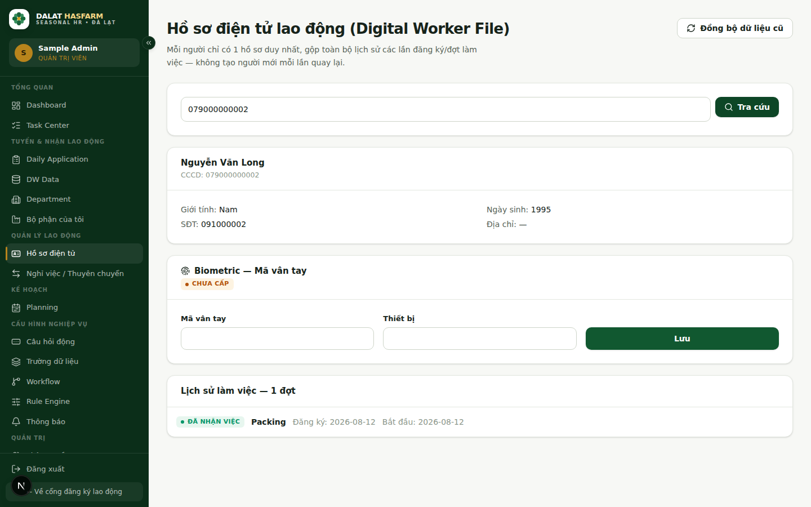

[← Mục lục](./README.md)

# 5. DW Data / Hồ sơ Tập nghề / Đợt Tập nghề

Đây là 3 khái niệm quan trọng trong hệ thống. Hiểu đúng 3 khái niệm này giúp bạn đọc đúng ý nghĩa của cột "DW Data" trên Daily Application và nắm rõ cách hệ thống lưu trữ lịch sử người tập nghề.

## 5.1 Ba khái niệm, ba vai trò khác nhau

| Khái niệm | Nó là gì | Khi nào được tạo |
|---|---|---|
| **DW Data** | Nguồn dữ liệu đối chiếu Tập nghề/lịch sử — trả lời câu hỏi "người này đã từng có trong dữ liệu công ty chưa?" | Được nạp sẵn từ dữ liệu đối chiếu lịch sử, hoặc tự động thêm mới khi HR duyệt một người đang gắn nhãn MỚI |
| **Internship Profile** (Hồ sơ Tập nghề) | **Hồ sơ duy nhất của một người**, gộp toàn bộ lịch sử các lần đăng ký và các đợt Tập nghề | Tự động tạo ngay khi người đó **đăng ký lần đầu** (kể cả trước khi HR duyệt) |
| **Internship Session** (Đợt Tập nghề) | Một **lần** đăng ký/một đợt Tập nghề cụ thể, gắn vào đúng 1 Hồ sơ Tập nghề | Tự động tạo mỗi lần có một lượt đăng ký mới |

**Ví dụ dễ hiểu:** Chị A đăng ký tập nghề lần đầu vào tháng 3 — hệ thống tạo 1 Hồ sơ Tập nghề (Internship Profile) cho chị A và 1 Đợt Tập nghề (Internship Session) cho đợt tháng 3 đó. Tháng 8, chị A quay lại đăng ký lần nữa. Hệ thống **nhận ra chị A đã có hồ sơ** (qua đối chiếu DW Data / CCCD), nên **không tạo người mới** — chỉ thêm 1 Đợt Tập nghề thứ hai vào đúng Hồ sơ Tập nghề cũ của chị A. Kết quả: chị A luôn chỉ có **1** hồ sơ duy nhất, có thể xem lại toàn bộ 2 đợt làm việc của mình ở cùng một nơi.

## 5.2 DW Data — Nguồn dữ liệu đối chiếu

Vào Sidebar → **DW Data (Đối chiếu)** (chỉ ADMIN, HR_RECRUITER).

Đây là nguồn dữ liệu đối chiếu lịch sử công ty để xác định người cũ/người mới:
- **Người tập nghề CŨ:** Đã có thông tin trong DW Data.
- **Người tập nghề MỚI:** Chưa từng có trong DW Data.

Nếu người đăng ký khai sai CCCD, bạn có thể sửa lại CCCD ngay tại DW Data — hệ thống sẽ tự động đồng bộ lại toàn bộ đơn đăng ký liên quan sang CCCD đúng.

Tìm kiếm theo CCCD / Họ tên / SĐT / Mã CODE (ví dụ định dạng mã: `DR0001-D`).

## 5.3 Hồ sơ Tập nghề (Internship Profile)

Vào Sidebar → nhóm **Quản lý Tập nghề** → **Hồ sơ Tập nghề**.

1. Nhập CCCD, bấm **Tra cứu**.
2. Xem thông tin cá nhân, mục **Biometric — Mã vân tay người tập nghề** (trạng thái Đã cấp/Chưa cấp — HR có thể nhập/sửa mã và thiết bị vân tay tại đây), và **Lịch sử đợt Tập nghề** — toàn bộ các Internship Session của người này, sắp xếp từ mới nhất tới cũ nhất.

> **Mẹo:** Nếu hệ thống báo "Không tìm thấy hồ sơ", rất có thể người này chưa từng đăng ký lần nào qua hệ thống — kiểm tra lại số CCCD.

Nút **"Đồng bộ dữ liệu cũ"** ở góc trên bên phải dùng để quét lại dữ liệu Daily Application cũ và tự tạo/liên kết Hồ sơ Tập nghề + Đợt Tập nghề còn thiếu — dùng khi nâng cấp hệ thống hoặc phát hiện dữ liệu cũ chưa được liên kết đầy đủ, không cần dùng hàng ngày.

Tiếp theo: [06 — Department & Bộ phận của tôi](./06-department.md)
