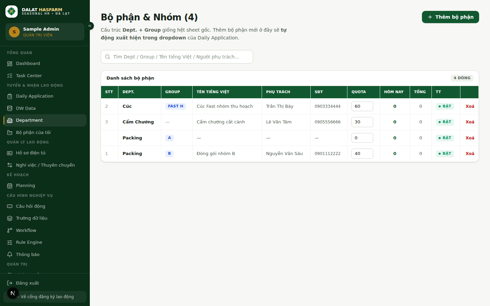
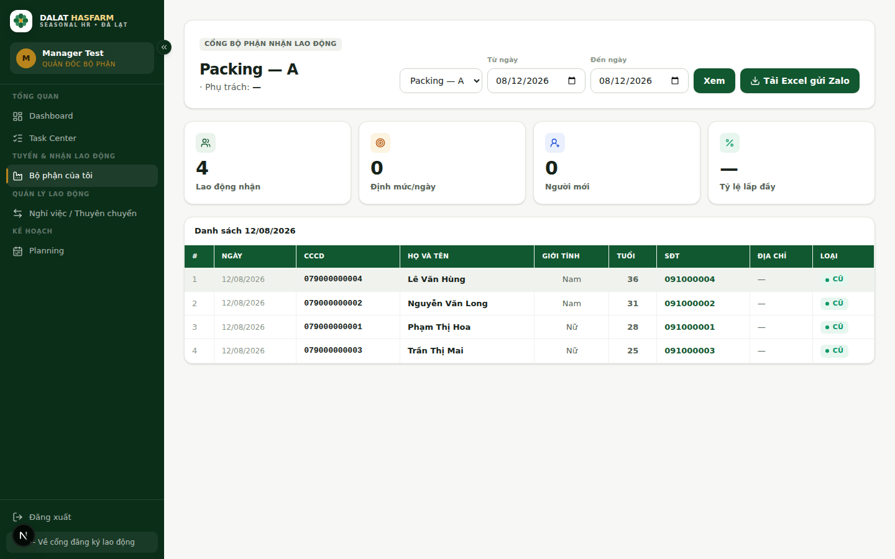

[← Mục lục](./README.md)

# 6. Cơ cấu tổ chức & "Bộ phận của tôi"

Hệ thống quản lý cơ cấu tổ chức Dalat Hasfarm theo chuẩn 5 tầng:

$$\text{Location} \longrightarrow \text{Division} \longrightarrow \text{Department} \longrightarrow \text{Section} \longrightarrow \text{Group}$$

Không sử dụng các thuật ngữ không chuẩn như "Xưởng", "Workshop" khi diễn đạt cơ cấu phòng ban.

Có **2 màn hình khác nhau** tuỳ vai trò:

| Màn hình | Ai dùng | Xem gì |
|---|---|---|
| **Cơ cấu tổ chức (Department)** (`/admin/departments`) | ADMIN, HR_RECRUITER | Quản lý **toàn bộ** danh mục bộ phận trong cơ cấu tổ chức |
| **Bộ phận của tôi** (`/department`) | DEPT_MANAGER (ADMIN/HR_RECRUITER cũng xem được) | Xem toàn bộ người tập nghề thuộc các bộ phận nằm trong **Data Scope** được phân công |

## 6.1 Cơ cấu tổ chức (dành cho Admin / HR)

- Phân cấp chuẩn: **Location** (Vùng/Trại) → **Division** (Khối) → **Department** (Tên bộ phận) → **Section** (Phân xưởng/Mảng) → **Group** (Tổ/Nhóm).
- Bấm **"+ Thêm bộ phận"** để tạo bộ phận mới — bộ phận vừa tạo **sẽ tự động xuất hiện trong dropdown xếp việc** ở Daily Application và Data Scope ngay lập tức.
- Có thể sửa trực tiếp trên bảng: **Nhu cầu nhân lực dự kiến/ngày**, bật/khoá bộ phận (nút **Bật/Khoá** ở cột trạng thái — khoá một bộ phận sẽ ẩn nó khỏi dropdown xếp việc mới nhưng không xoá dữ liệu cũ), và **Xoá** (xoá mềm — đưa vào Thùng rác).
- Các cột "Hôm nay" / "Tổng" cho biết số người tập nghề đã được xếp vào bộ phận đó.

## 6.2 "Bộ phận của tôi" (dành cho Quản lý bộ phận — DEPT_MANAGER)

Đây là cổng dành cho Quản lý bộ phận để theo dõi và quản lý người tập nghề trong phạm vi phụ trách:

### Mặc định hiển thị toàn bộ phạm vi Data Scope
Khi vào trang, hệ thống **tự động hiển thị danh sách tất cả người tập nghề thuộc mọi bộ phận được gán cho bạn** trong Data Scope, không bắt buộc bạn phải chọn từng bộ phận riêng lẻ trước khi xem.

### Bộ lọc linh hoạt theo cơ cấu tổ chức
Bạn có thể nhanh chóng thu hẹp danh sách theo:
- **Location** (Địa điểm / Trại)
- **Division** (Khối)
- **Department** (Bộ phận)
- **Section** (Phân xưởng / Mảng)
- **Group** (Tổ / Nhóm)
- **Khoảng ngày** (Từ ngày → Đến ngày)
- **Tìm kiếm nhanh** theo Họ tên, CCCD, Số điện thoại.

### Bảng dữ liệu chuẩn hóa
Bảng tập trung vào các thông tin điều hành cần thiết:
- Checkbox chọn dòng (Multi-select)
- STT, Họ và tên, CCCD (đã che bảo mật)
- Giới tính (Nam / Nữ)
- Department, Section, Group
- Ngày bắt đầu, Trạng thái tiếp nhận
- Nút thao tác nhanh: **Báo nghỉ Tập nghề**, **Xem Hồ sơ Tập nghề**.
*(Đã loại bỏ các cột không cần thiết như Loại CŨ/MỚI, Tuổi).*

### Chọn nhiều người (Multi-select) & Thao tác hàng loạt (Bulk Actions)
- Bạn có thể tick chọn từng người hoặc bấm **"Chọn tất cả"** trên danh sách đang hiển thị.
- Khi chọn từ 1 người trở lên, thanh công cụ **Bulk Action Bar** nổi phía dưới sẽ xuất hiện:
  - **Báo nghỉ việc hàng loạt:** Mở hộp thoại nhập ngày hiệu lực, lý do nghỉ việc để gửi hàng loạt yêu cầu báo nghỉ cho HR duyệt.
  - **Xuất Excel đã chọn:** Xuất file danh sách những người đã chọn để gửi Zalo hoặc in ấn.
  - **Bỏ chọn:** Huỷ chọn tất cả.

> **Lưu ý — Data Scope:** Quản lý bộ phận **chỉ nhìn thấy người tập nghề thuộc (các) bộ phận được phân công** tại [Data Scope](./10-permissions-data-scope.md). Nếu bạn không thấy bộ phận mình phụ trách, liên hệ Admin để được gán đúng bộ phận tại màn hình Quản trị Data Scope.

Tiếp theo: [07 — Planning](./07-planning.md)
