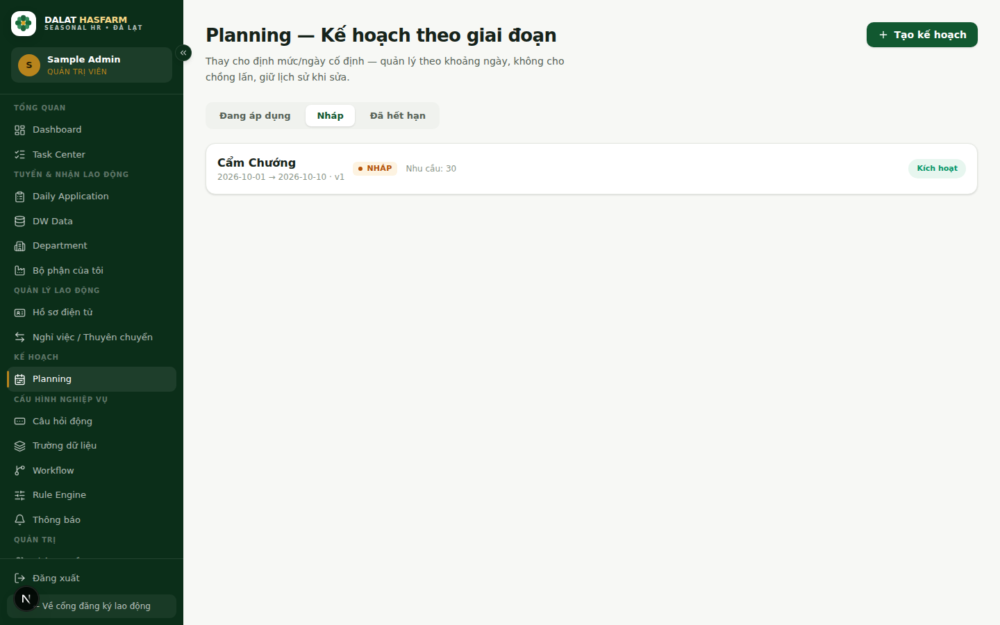
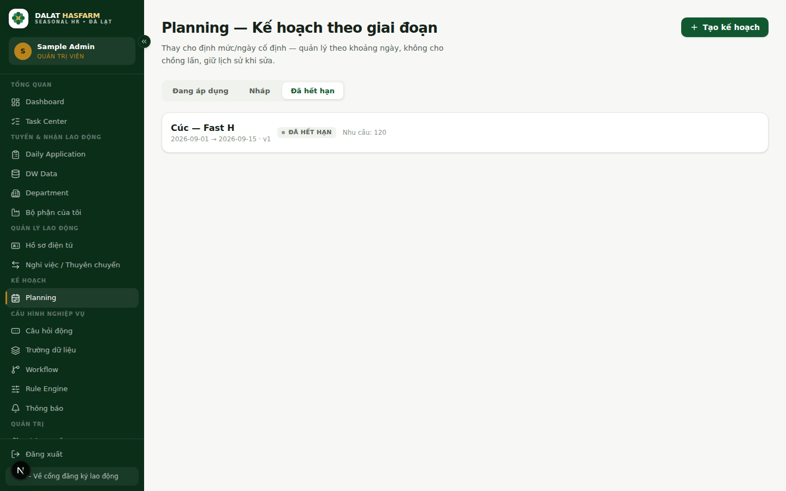

[← Mục lục](./README.md)

# 7. Planning

**Ai dùng:** xem được cả 3 vai trò (tuỳ Data Scope); tạo/sửa cần quyền `planning.manage` (mặc định ADMIN, HR_RECRUITER).

## 7.1 Planning là gì?

Planning thay thế cho "Định mức lao động/ngày" cố định trên Department bằng cách quản lý nhu cầu nhân lực **theo từng giai đoạn** (khoảng ngày cụ thể), cho một bộ phận. Ví dụ thực tế:

> *Bộ phận Cúc – Fast H cần 120 lao động, từ ngày 01/09 đến 15/09.*

Đây chính là một "kế hoạch" (Planning Period) — thay vì phải nhớ một con số quota cố định áp dụng mãi mãi, bạn khai báo rõ **cần bao nhiêu người, trong khoảng thời gian nào**.

## 7.2 Ba trạng thái của một kế hoạch

| Trạng thái | Ý nghĩa |
|---|---|
| **Nháp** (Draft) | Đã tạo nhưng chưa áp dụng — chưa tính vào số liệu vận hành |
| **Đang áp dụng** (Active) | Kế hoạch đang có hiệu lực — hệ thống tính tỷ lệ lấp đầy thực tế cho kế hoạch này |
| **Đã hết hạn** (Expired) | Kế hoạch cũ, đã bị thay thế bởi phiên bản mới hơn hoặc đã qua ngày kết thúc |

Chuyển đổi giữa 3 tab **Đang áp dụng / Nháp / Đã hết hạn** ở đầu trang để xem từng nhóm.

 

## 7.3 Đọc chỉ số lấp đầy (Fill Rate)

Với kế hoạch **Đang áp dụng**, mỗi dòng hiện: `active/demand (percent%)`, kèm `· thiếu N` nếu chưa đủ.

| Chỉ số | Ý nghĩa |
|---|---|
| **Nhu cầu (demand)** | Số lượng lao động kế hoạch cần — đúng bằng "Nhu cầu (số lượng)" bạn khai khi tạo |
| **Đang có (active)** | Số lao động thực tế đã được phân bổ vào kế hoạch này |
| **Thiếu (missing)** | `Nhu cầu − Đang có` (không bao giờ âm) |
| **Tỷ lệ %** | `Đang có ÷ Nhu cầu`, làm tròn |

Kế hoạch ở trạng thái Nháp/Đã hết hạn không hiện tỷ lệ lấp đầy — chỉ hiện "Nhu cầu: N" đơn thuần.

## 7.4 Tạo kế hoạch mới

Bấm **"+ Tạo kế hoạch"**, điền:
1. **Bộ phận** — bắt buộc.
2. **Từ ngày / Đến ngày** — bắt buộc, không được trùng khoảng ngày với một kế hoạch **Đang áp dụng** khác của cùng bộ phận + nhóm.
3. **Nhu cầu (số lượng)** — bắt buộc.
4. **Ghi chú** — tuỳ chọn.
5. Tick **"Kích hoạt ngay"** để tạo thẳng ở trạng thái Đang áp dụng, hoặc bỏ tick để lưu Nháp trước.

Nếu kích hoạt ngay và có lao động **chưa thuộc kế hoạch nào** (Unplanned) ở bộ phận đó, hệ thống sẽ tự mở hộp thoại **"Phân bổ lao động chưa có kế hoạch"** để bạn gán họ vào kế hoạch vừa tạo.

## 7.5 Sửa kế hoạch — giữ nguyên lịch sử (Versioning)

Bấm **"Sửa (tạo version mới)"** trên một kế hoạch Đang áp dụng. Đây **không phải** sửa đè lên kế hoạch cũ — hệ thống:

1. Tạo một **phiên bản mới** (version + 1) với thông tin bạn vừa sửa.
2. Chuyển **phiên bản cũ sang trạng thái "Đã hết hạn"** — không xoá, vẫn xem lại được ở tab Đã hết hạn.

> **Mẹo:** Nhờ cơ chế này, bạn luôn có thể xem lại "kế hoạch ban đầu là gì, đã điều chỉnh những gì, khi nào" mà không lo mất dữ liệu lịch sử.

## 7.6 Phân bổ lao động chưa có kế hoạch

Bấm **"Phân bổ lao động"** trên một kế hoạch Đang áp dụng để xem danh sách lao động đang làm ở bộ phận đó nhưng **chưa thuộc kế hoạch Đang áp dụng nào** (Unplanned), tick chọn người cần gán, bấm **"Phân bổ đã chọn"**.

Tiếp theo: [08 — Workforce Movement](./08-workforce-movement.md)
