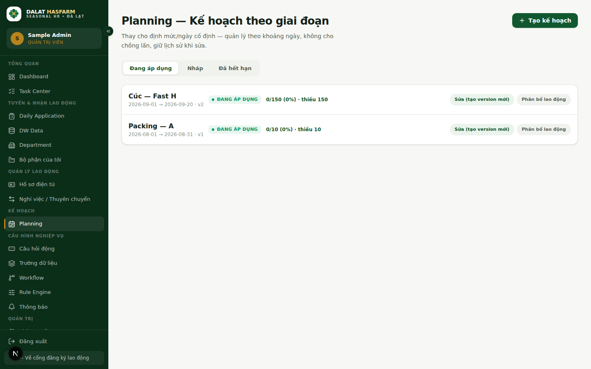

[← Mục lục](./README.md)

# 7. Planning — Kế hoạch Nhu cầu Tập nghề

**Ai dùng:** Xem được cả 3 vai trò (tuỳ theo Data Scope); tạo/sửa kế hoạch cần quyền `planning.manage` (mặc định `ADMIN`, `HR_RECRUITER`).

## 7.1 Planning là gì?

Planning là công cụ quản lý **Nhu cầu tuyển dụng Tập nghề theo từng giai đoạn** (khoảng ngày cụ thể) cho từng bộ phận theo cơ cấu tổ chức Location → Division → Department → Section → Group.

Hệ thống sử dụng các thuật ngữ tuyển dụng chuẩn:
- **Nhu cầu nhân lực / Nhu cầu Tập nghề** (không dùng thuật ngữ Quota).
- **Phân bổ:** Số lượng người tập nghề đã được xếp vào bộ phận.
- **Nghỉ việc:** Số lượng người tập nghề trong kế hoạch đã nghỉ việc.
- **Cần tuyển:** Số lượng nhân sự cần tiếp tục tuyển dụng để đáp ứng đủ nhu cầu.

## 7.2 Cho phép nhiều kế hoạch trùng thời gian & Yêu cầu bổ sung

Hệ thống cho phép **nhiều kế hoạch cùng tồn tại trong cùng một khoảng thời gian** cho cùng một bộ phận, phân biệt rõ giữa hai khái niệm:

1. **Kế hoạch gốc (Original):** Yêu cầu nhân lực ban đầu của bộ phận cho một đợt tập nghề.
2. **Yêu cầu bổ sung (Supplement):** Khi bộ phận phát sinh nhu cầu tăng thêm nhân sự trong cùng khoảng thời gian (Bổ sung lần 1, Bổ sung lần 2...). Đây là các yêu cầu cộng dồn nhu cầu, không phải thay thế kế hoạch gốc.
3. **Phiên bản mới (Versioning):** Khi cần chỉnh sửa thông tin của một kế hoạch đang chạy, hệ thống tạo ra một phiên bản mới (v2, v3) và chuyển bản cũ sang trạng thái Đã hết hạn để giữ nguyên lịch sử kiểm toán.

## 7.3 Phân tách giới tính & Công thức tính tự động

Mỗi kế hoạch quản lý chi tiết theo giới tính:

| Nhóm chỉ số | Chi tiết | Cách tính / Nguồn dữ liệu |
|---|---|---|
| **Nhu cầu cần** | Nhu cầu Nam (`demandMale`), Nhu cầu Nữ (`demandFemale`) | Do người tạo kế hoạch nhập |
| **Phân bổ** | Phân bổ Nam (`allocatedMale`), Phân bổ Nữ (`allocatedFemale`) | Tự động tổng hợp từ các đợt tập nghề đã được xếp việc (`APPROVED`) vào kế hoạch này |
| **Nghỉ việc** | Nghỉ Nam (`resignedMale`), Nghỉ Nữ (`resignedFemale`) | Tự động tổng hợp từ các yêu cầu Nghỉ việc (`RESIGNATION`) đã có hiệu lực (`INACTIVE`) của kế hoạch |
| **Cần tuyển** | Cần tuyển Nam, Cần tuyển Nữ, Tổng cần tuyển | **Tự động tính theo công thức tuyển dụng chuẩn** |

### Công thức tính số Cần tuyển:

$$\text{Cần tuyển Nam} = \max(0, \text{Nhu cầu Nam} - \text{Phân bổ Nam} + \text{Nghỉ việc Nam})$$

$$\text{Cần tuyển Nữ} = \max(0, \text{Nhu cầu Nữ} - \text{Phân bổ Nữ} + \text{Nghỉ việc Nữ})$$

$$\text{Tổng cần tuyển} = \text{Cần tuyển Nam} + \text{Cần tuyển Nữ}$$

**Ví dụ thực tế:**
- **Nam:** Nhu cầu = 20, Phân bổ = 15, Nghỉ việc = 2 $\longrightarrow$ **Cần tuyển = $20 - 15 + 2 = 7$**
- **Nữ:** Nhu cầu = 30, Phân bổ = 25, Nghỉ việc = 1 $\longrightarrow$ **Cần tuyển = $30 - 25 + 1 = 6$**
- **Tổng cần tuyển:** $7 + 6 = 13$ người.

> **Quy tắc bảo vệ:** Người dùng không nhập tay cột "Cần tuyển". Nếu số lượng phân bổ thực tế vượt quá nhu cầu, hệ thống tự động giữ số Cần tuyển ở mức **0** (không để xảy ra số cần tuyển âm).

## 7.4 Tự động cập nhật Phân bổ, Nghỉ việc và Thuyên chuyển

Hệ thống tự động liên kết các luồng vận hành để cập nhật dữ liệu Planning theo thời gian thực:

1. **Khi HR xếp việc (Recruiter Assignment):**
   - Khi một người tập nghề được duyệt nhận việc (`APPROVED`) và gán vào bộ phận, hệ thống tự động tìm kế hoạch ACTIVE phù hợp (ưu tiên kế hoạch gốc, sau đó đến các kế hoạch bổ sung còn thiếu chỉ tiêu theo đúng giới tính) và cập nhật số Phân bổ.
   - Thao tác là giao dịch an toàn (transactional), chống trùng lặp (idempotent) khi chỉnh sửa bộ phận hoặc duyệt lại.

2. **Khi có Nghỉ việc (Resignation):**
   - Khi yêu cầu nghỉ việc được HR phê duyệt có hiệu lực, số lượng Nghỉ việc của kế hoạch tương ứng tự động tăng lên, kéo theo số Cần tuyển tăng tương ứng để bộ phận tiếp tục tuyển bù.

3. **Khi có Thuyên chuyển (Transfer):**
   - Khi người tập nghề hoàn tất thuyên chuyển đến bộ phận mới (`CONFIRM_ARRIVED`), bộ phận nguồn được giảm phân bổ và bộ phận đích được tự động tăng phân bổ vào kế hoạch đang áp dụng của bộ phận đích.
   - Không cập nhật khi yêu cầu mới ở trạng thái chờ duyệt (`PENDING_HR`).

## 7.5 Tạo kế hoạch gốc & Yêu cầu bổ sung

1. **Tạo kế hoạch gốc:**
   - Bấm **"+ Kế hoạch gốc mới"**
   - Chọn Bộ phận, khoảng ngày (Từ ngày → Đến ngày).
   - Nhập Nhu cầu Nam và Nhu cầu Nữ.
   - Chọn Kích hoạt ngay (Active) hoặc lưu Nháp (Draft).

2. **Tạo yêu cầu bổ sung:**
   - Bấm **"Yêu cầu bổ sung"**
   - Chọn Bộ phận và liên kết với Kế hoạch gốc tương ứng trong khoảng thời gian đó.
   - Nhập Nhu cầu bổ sung (Nam / Nữ).
   - Hệ thống tự động đánh số thứ tự bổ sung (Bổ sung 1, Bổ sung 2...).

## 7.6 Sửa kế hoạch — Lưu lịch sử phiên bản (Versioning)

Khi cần điều chỉnh ngày hoặc nhu cầu của một kế hoạch đang chạy:
1. Bấm **"Sửa (tạo version mới)"** trên dòng kế hoạch.
2. Nhập thông tin điều chỉnh.
3. Hệ thống tạo ra **phiên bản mới (v2, v3...)**, giữ nguyên toàn bộ liên kết phân bổ hiện tại và chuyển bản ghi cũ sang trạng thái **Đã hết hạn** để lưu vết kiểm toán.

Tiếp theo: [08 — Workforce Movement](./08-workforce-movement.md)
