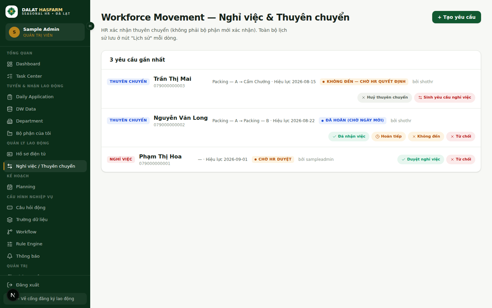
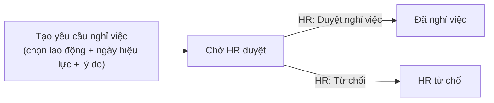
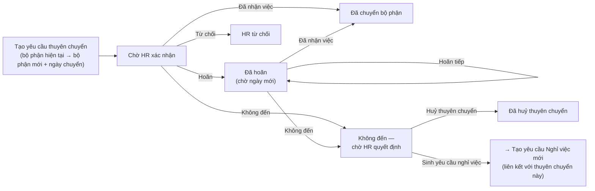

[← Mục lục](./README.md)

# 8. Workforce Movement (Nghỉ việc & Thuyên chuyển)

**Ai dùng:** xem/tạo yêu cầu — cả 3 vai trò (tuỳ quyền); HR (`ADMIN`, `HR_RECRUITER`) là người **xác nhận** cuối cùng.

> **Quan trọng:** HR luôn là người xác nhận thuyên chuyển — **không phải bộ phận mới xác nhận**. Nếu bạn là Quản đốc bộ phận nhận người thuyên chuyển đến, bạn không cần (và không thể) tự xác nhận trên hệ thống — HR sẽ xử lý.

## 8.1 Hai loại yêu cầu

### Nghỉ việc (Resignation)

### Thuyên chuyển (Transfer)

## 8.2 Tạo yêu cầu mới

Bấm **"+ Tạo yêu cầu"**:

1. **Tìm lao động theo CCCD** — bắt buộc tìm và chọn đúng người trước.
2. **Loại yêu cầu** — Nghỉ việc hoặc Thuyên chuyển.
3. Nếu là Thuyên chuyển: chọn **Bộ phận mới** — bắt buộc.
4. **Ngày hiệu lực** — bắt buộc.
5. **Lý do**, **Ghi chú** — tuỳ chọn nhưng nên ghi rõ để HR xử lý nhanh và dễ tra cứu về sau.
6. Bấm **"Gửi yêu cầu (chờ HR duyệt)"**.

## 8.3 Các hành động HR có thể thực hiện

| Trạng thái hiện tại | Hành động khả dụng | Kết quả |
|---|---|---|
| Nghỉ việc — Chờ HR duyệt | **Duyệt nghỉ việc** | Chuyển sang Đã nghỉ việc |
| | **Từ chối** | Chuyển sang HR từ chối |
| Thuyên chuyển — Chờ HR xác nhận | **Đã nhận việc** | Chuyển sang Đã chuyển bộ phận |
| | **Hoãn** (nhập ngày chuyển mới) | Chuyển sang Đã hoãn (chờ ngày mới) |
| | **Không đến** | Chuyển sang Không đến — chờ HR quyết định |
| | **Từ chối** | Chuyển sang HR từ chối |
| Thuyên chuyển — Đã hoãn | **Đã nhận việc** / **Hoãn tiếp** / **Không đến** / **Từ chối** | Như trên |
| Thuyên chuyển — Không đến, chờ quyết định | **Huỷ thuyên chuyển** | Chuyển sang Đã huỷ thuyên chuyển, không tạo gì thêm |
| | **Sinh yêu cầu nghỉ việc** | Tự động tạo **một yêu cầu Nghỉ việc mới**, liên kết với yêu cầu thuyên chuyển này, để xử lý tiếp theo hướng "người này đã nghỉ hẳn" |

> **Lưu ý:** "Sinh yêu cầu nghỉ việc" chỉ tạo được **đúng 1 lần** cho mỗi yêu cầu thuyên chuyển — bấm lại nhiều lần (double-click, mạng chậm...) sẽ không tạo trùng thêm yêu cầu nghỉ việc thứ hai.

## 8.4 Xem lịch sử

Toàn bộ lịch sử xử lý của một yêu cầu (ai tạo, ai xử lý, đổi trạng thái khi nào) được lưu lại — dùng nút **"Lịch sử"** trên mỗi dòng để xem lại.

## 8.5 Phạm vi dữ liệu

Danh sách yêu cầu hiển thị theo đúng Data Scope của bạn — Quản đốc bộ phận chỉ thấy yêu cầu liên quan tới bộ phận được phân công. Xem [chương 10](./10-permissions-data-scope.md).

Tiếp theo: [09 — Các module Admin](./09-admin-modules.md)
