[← Mục lục](./README.md)

# 9. Các module Admin

Chương này hướng dẫn các module chỉ (hoặc chủ yếu) dành cho **Quản trị viên**. Không đi sâu vào cách hệ thống được lập trình — chỉ tập trung vào "dùng khi nào, ai được dùng, thao tác chính, lưu ý".

## Users (Phân quyền RBAC)

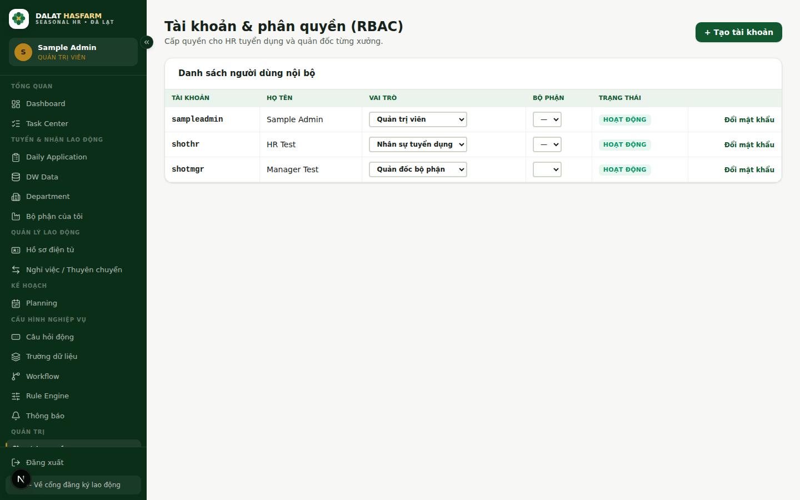

**Dùng khi nào:** cấp/thu hồi tài khoản cho nhân viên nội bộ.
**Ai được dùng:** chỉ `ADMIN`.
**Thao tác chính:**
- Bấm **"+ Tạo tài khoản"**, nhập Tên tài khoản, Mật khẩu, Họ tên, chọn **Vai trò** (`ADMIN` / `HR_RECRUITER` / `DEPT_MANAGER`) và **Bộ phận** (chỉ áp dụng khi vai trò là `DEPT_MANAGER`).
- Đổi vai trò, đổi bộ phận, bật/khoá tài khoản, đổi mật khẩu trực tiếp trên bảng.

> **Lưu ý:** Mật khẩu tối thiểu 8 ký tự. Khoá tài khoản (thay vì xoá) là cách được khuyến khích khi nhân viên nghỉ việc — giữ lại được lịch sử thao tác của họ trong Nhật ký hệ thống.

## Phân quyền chi tiết (Permissions)

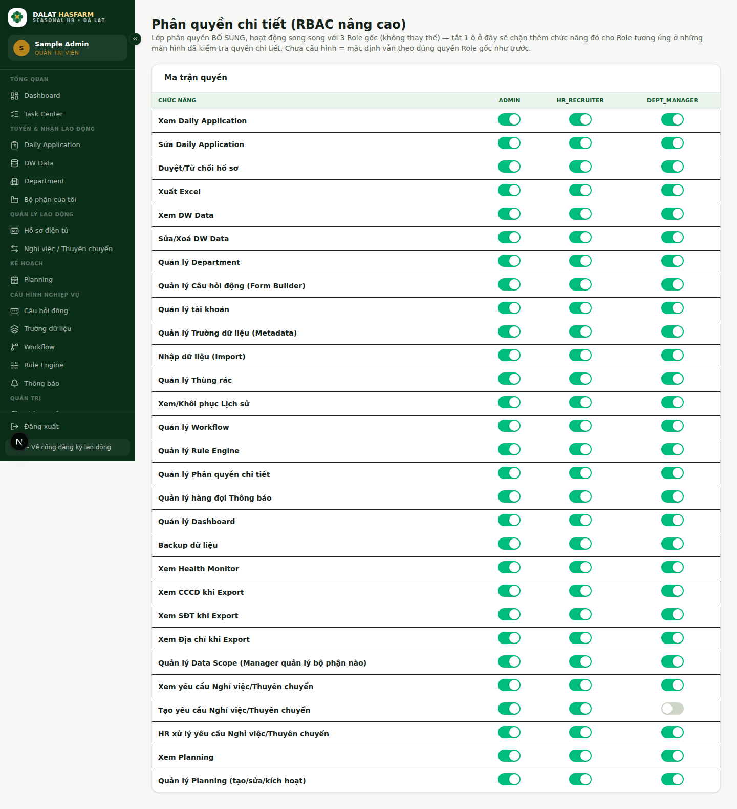

**Dùng khi nào:** cần **bật/tắt một chức năng cụ thể** cho một vai trò, mà không muốn đổi hẳn vai trò của người đó.
**Ai được dùng:** chỉ `ADMIN`.
**Thao tác chính:** bấm vào từng công tắc trong ma trận (hàng = chức năng, cột = vai trò) để bật/tắt ngay lập tức, không cần lưu riêng.

> **Quan trọng:** Đây là lớp phân quyền **bổ sung song song** với 3 vai trò gốc — không thay thế vai trò. Một ô **chưa từng được đụng tới** mặc định luôn là **cho phép** (để admin không lỡ tay tự khoá cả hệ thống). Chỉ khi bạn chủ động tắt một ô, chức năng đó mới bị chặn cho đúng vai trò ở ô đó. Xem mô hình đầy đủ ở [chương 10](./10-permissions-data-scope.md).

## Data Scope

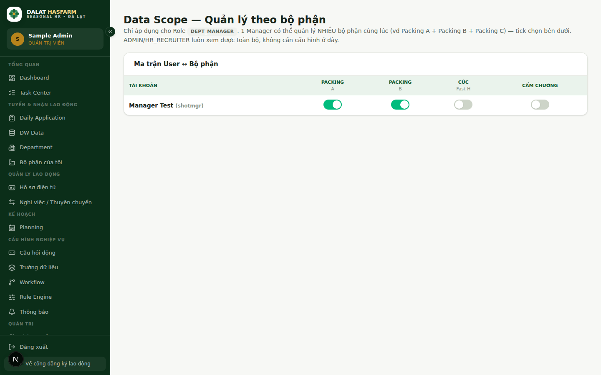

**Dùng khi nào:** giới hạn một Quản đốc bộ phận chỉ được xem dữ liệu của (các) bộ phận cụ thể.
**Ai được dùng:** chỉ `ADMIN`. Chỉ áp dụng cho vai trò `DEPT_MANAGER` — `ADMIN`/`HR_RECRUITER` luôn xem toàn bộ, không cần cấu hình ở đây.
**Thao tác chính:** bật công tắc ở ô giao giữa 1 tài khoản và 1 bộ phận để cấp quyền xem bộ phận đó — một tài khoản có thể được bật nhiều bộ phận cùng lúc.

## Câu hỏi động (Form Builder)

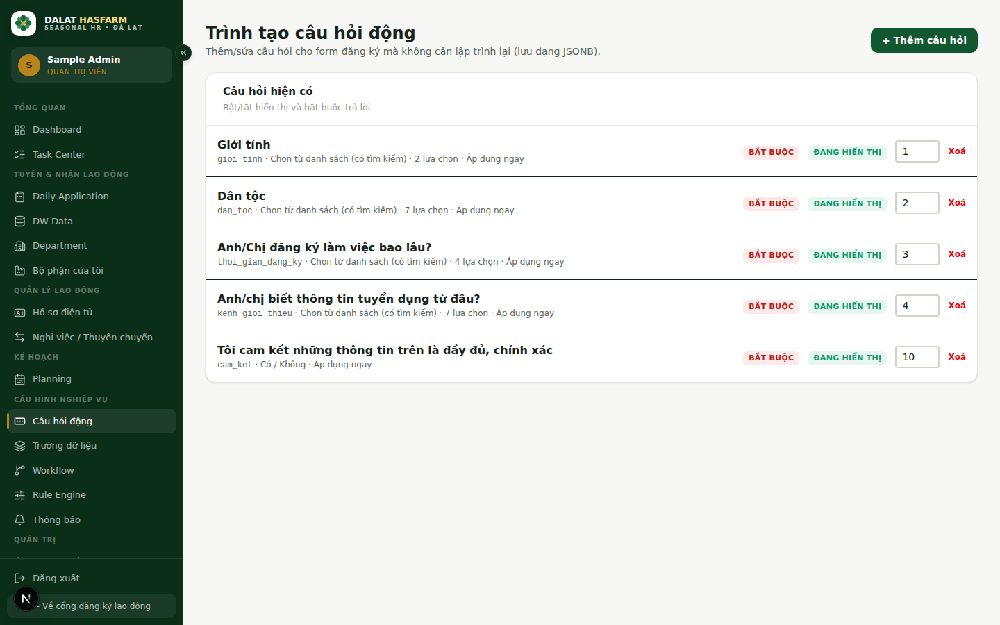

**Dùng khi nào:** cần thêm/sửa/xoá câu hỏi trên form đăng ký công khai mà không cần lập trình viên can thiệp.
**Ai được dùng:** `ADMIN`, `HR_RECRUITER`.
**Thao tác chính:** tạo câu hỏi mới với: **Field Key** (mã định danh nội bộ), **Câu hỏi hiển thị**, **Loại** (Nhập văn bản / Nhập số / Chọn từ danh sách), **Bắt buộc trả lời hay không**, **Thứ tự hiển thị**, **Ngày áp dụng** (câu hỏi chỉ hiện từ ngày này trở đi — form cũ không bị ảnh hưởng).

> **Lưu ý:** Câu hỏi **bắt buộc** chỉ áp dụng cho người đăng ký **lần đầu** — lao động cũ xác nhận nhanh không phải trả lời lại các câu hỏi này.

## Trường dữ liệu (Metadata Engine)

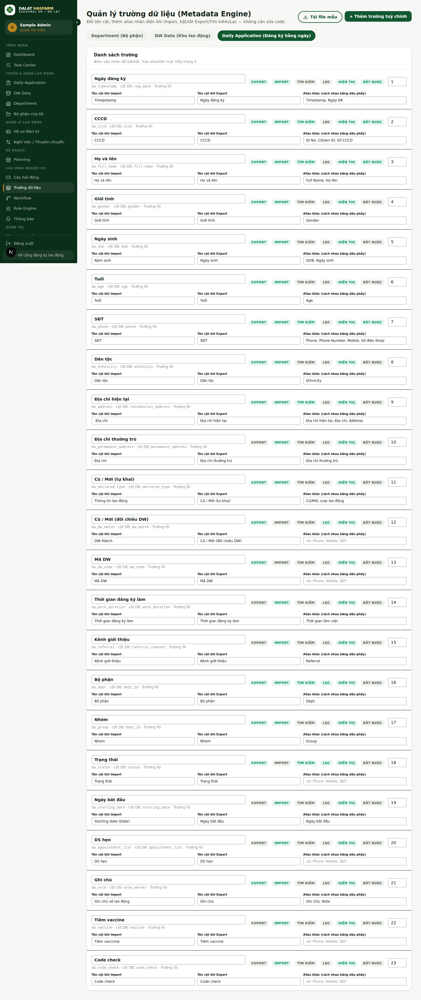

**Dùng khi nào:** đổi tên cột khi Import/Export, hoặc bật/tắt một cột trong ô "Tìm nhanh" — tất cả **không cần sửa code**.
**Ai được dùng:** chỉ `ADMIN`.
**Thao tác chính:** với mỗi trường, khai báo: **Tên cột khi Import**, **Tên cột khi Export**, **Alias** (các tên gọi khác cách nhau bằng dấu phẩy — giúp Import nhận diện file có tên cột khác chuẩn), bật/tắt **Tìm kiếm**, **Lọc**, **Hiển thị**, **Bắt buộc**, và **Thứ tự** cột.

## Workflow

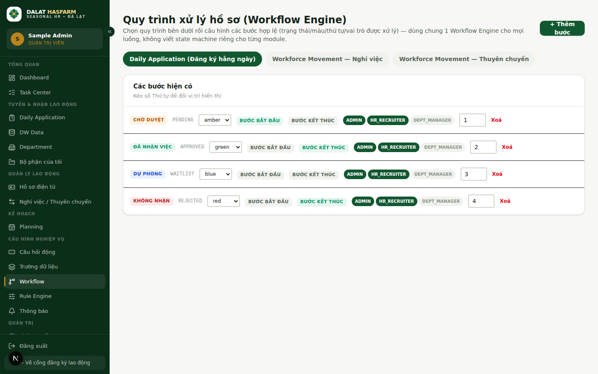

**Dùng khi nào:** thêm/sửa/đổi thứ tự các bước trạng thái cho Daily Application, Nghỉ việc, hoặc Thuyên chuyển — **dùng chung một engine cho cả 3 luồng**, không có state machine viết riêng cho từng module.
**Ai được dùng:** chỉ `ADMIN`.
**Thao tác chính:** chọn 1 trong 3 luồng (tab ở đầu trang), với mỗi bước khai báo: **Nhãn hiển thị**, **Màu** (gray/green/amber/red/blue/gold), có phải **Bước bắt đầu**/**Bước kết thúc**, **Vai trò được xử lý** bước này, **Thứ tự**.

> **Quan trọng:** Đổi tên/màu một bước ở đây **không cần** cập nhật lại dữ liệu cũ — giá trị trạng thái lưu trong dữ liệu không đổi, Workflow chỉ mô tả "bước này hiển thị ra sao".

## Rule Engine

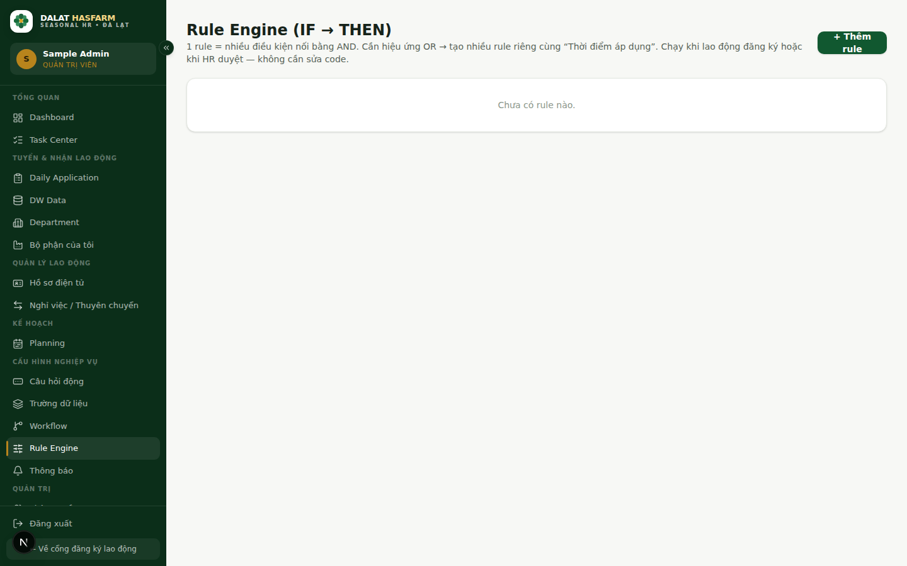

**Dùng khi nào:** cần tự động hoá kiểu **"nếu ... thì ..."** khi có đăng ký mới hoặc khi duyệt, mà không cần viết code — ví dụ "nếu tuổi dưới 18 thì tự động đánh dấu ghi chú cảnh báo".
**Ai được dùng:** chỉ `ADMIN`.
**Thao tác chính:** tạo rule gồm: **Tên rule**, **Áp dụng cho** (Daily Application), **Thời điểm chạy** (Khi đăng ký / Khi duyệt), một hoặc nhiều **Điều kiện** (nối bằng AND), và **Hành động** (Đổi trạng thái tự động, hoặc Gắn ghi chú cảnh báo).

> **Lưu ý:** Muốn có hiệu ứng OR (hoặc điều kiện này, hoặc điều kiện kia) — tạo **nhiều rule riêng** thay vì gộp vào 1 rule, vì các điều kiện trong cùng 1 rule luôn được nối bằng AND.

## Thông báo (Notifications)

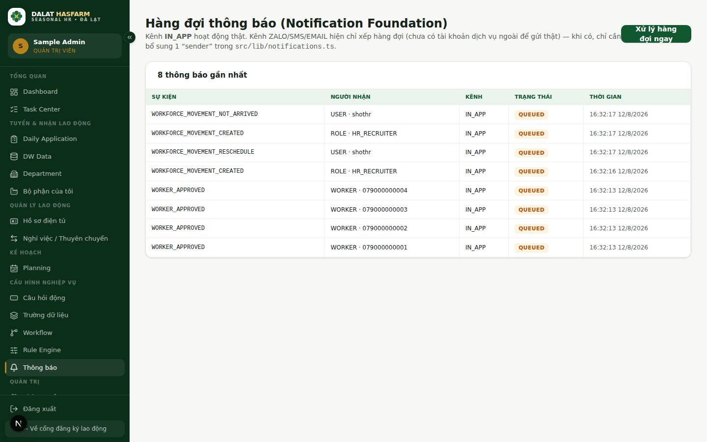

**Dùng khi nào:** theo dõi các sự kiện hệ thống đã tạo ra thông báo (duyệt hồ sơ, tạo yêu cầu nghỉ việc/thuyên chuyển...).
**Ai được dùng:** `ADMIN`, `HR_RECRUITER`.

> **Lưu ý quan trọng:** Chỉ kênh **IN_APP** (thông báo trong hệ thống) hoạt động thật ở thời điểm hiện tại. Các kênh **ZALO / SMS / EMAIL** hiện **chỉ xếp vào hàng đợi** (trạng thái *Đã xếp hàng*) — hệ thống **chưa thực sự gửi ra ngoài** vì chưa kết nối tài khoản dịch vụ gửi tin. Không nên báo với người lao động/đồng nghiệp rằng họ "sẽ nhận SMS/Zalo tự động" cho tới khi tính năng này được xác nhận đã kết nối dịch vụ thật.

## Nhập dữ liệu ban đầu (Import Data)

Xem chi tiết ở [chương 11 — Import/Export](./11-import-export.md).

## Thùng rác (Recycle Bin)

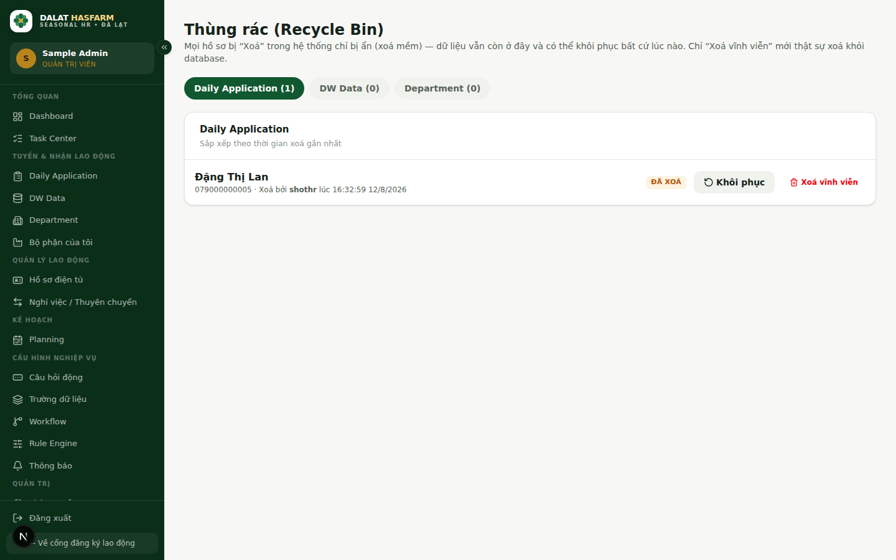

**Dùng khi nào:** khôi phục một bản ghi vừa bị xoá nhầm.
**Ai được dùng:** chỉ `ADMIN`.
**Phạm vi:** chỉ áp dụng cho 3 loại dữ liệu — **Daily Application**, **DW Data**, **Department**. (Không áp dụng cho Worker Profile hay Workforce Movement — các loại dữ liệu này hiện chưa có thao tác xoá trên giao diện.)
**Thao tác chính:** chọn tab loại dữ liệu, bấm **Khôi phục** để đưa bản ghi trở lại hoạt động bình thường, hoặc **Xoá vĩnh viễn** nếu chắc chắn không cần nữa.

> **Quan trọng:** "Xoá vĩnh viễn" **không thể hoàn tác**. Chỉ dùng khi chắc chắn 100%.

## Control Center (System)

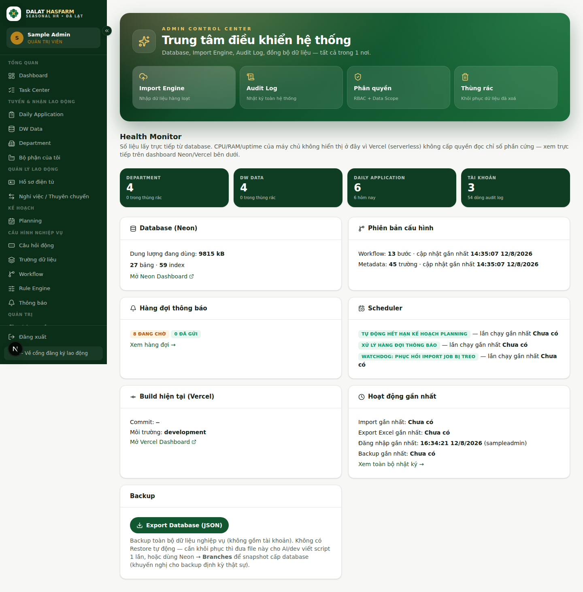

**Dùng khi nào:** kiểm tra sức khoẻ hệ thống định kỳ, hoặc tải bản sao lưu dữ liệu.
**Ai được dùng:** chỉ `ADMIN`.
**Gồm:** dung lượng & số bảng dữ liệu (Neon Database), phiên bản cấu hình Workflow/Metadata hiện tại, hàng đợi thông báo, lịch chạy các tác vụ nền (job tự động hết hạn Planning, xử lý hàng đợi thông báo, giám sát Import job bị treo), thông tin bản build đang chạy trên Vercel, hoạt động gần nhất, và nút **Backup**.

> **Lưu ý:** Các chỉ số CPU/RAM/uptime **không hiển thị ở đây** vì Vercel (nền tảng serverless) không cấp quyền đọc chỉ số phần cứng máy chủ — cần xem trực tiếp trên Vercel Dashboard/Neon Dashboard (có link tắt ngay trong trang này).

## Nhật ký hệ thống (Audit Log)

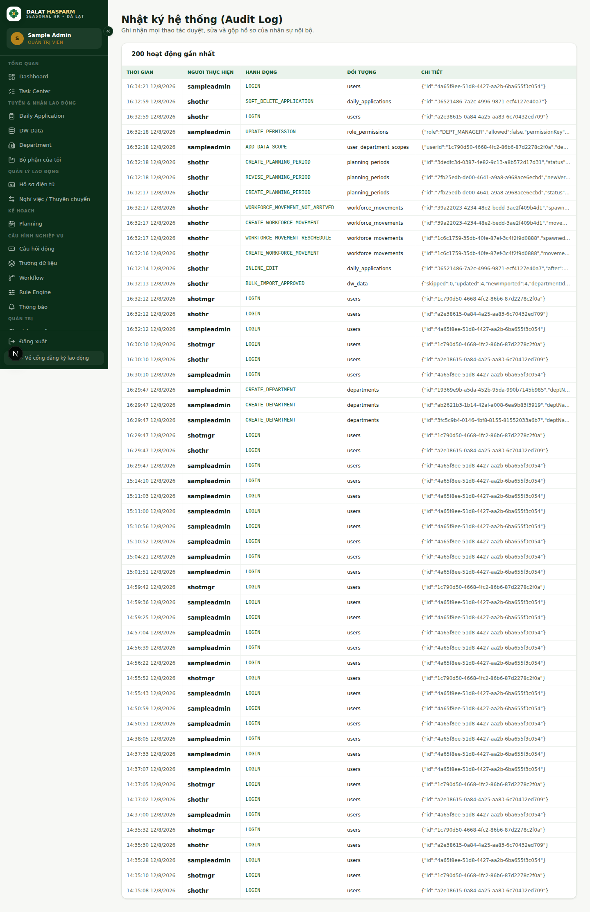

**Dùng khi nào:** tra cứu "ai đã làm gì, khi nào" — đăng nhập, duyệt hồ sơ, sửa dữ liệu, xoá, khôi phục...
**Ai được dùng:** chỉ `ADMIN`.
**Hiển thị:** 200 hoạt động gần nhất — Thời gian, Người thực hiện, Hành động, Đối tượng bị tác động, Chi tiết (dạng dữ liệu thô, hữu ích khi cần tra cứu chính xác giá trị trước/sau).

Tiếp theo: [10 — Permissions & Data Scope](./10-permissions-data-scope.md)
