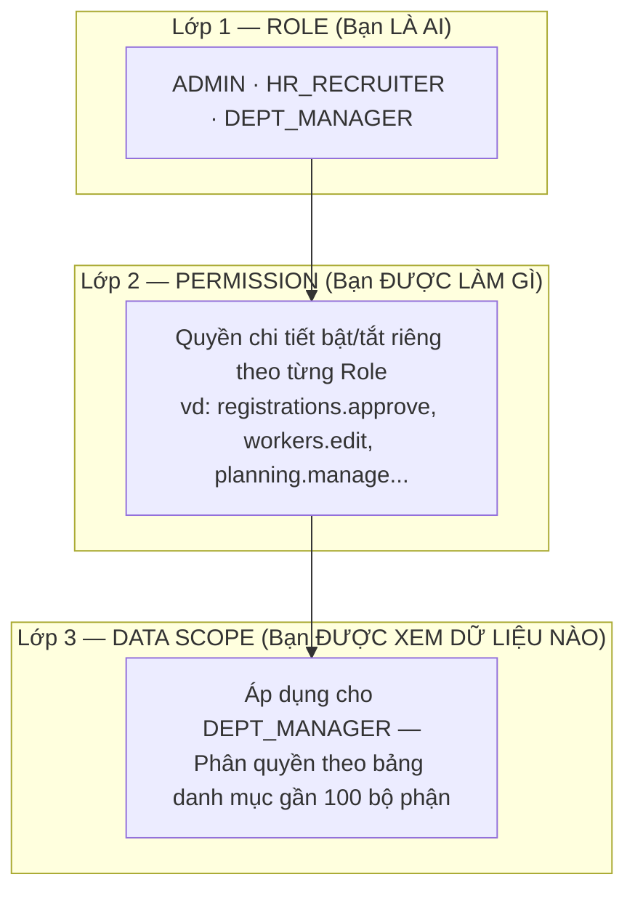

[← Mục lục](./README.md)

# 10. Permissions & Data Scope (Phân quyền dữ liệu)

Hệ thống phân quyền theo **3 lớp độc lập**:

## 10.1 Lớp 1 — Role (Vai trò hệ thống)

3 vai trò cố định:
- `ADMIN`: Quản trị viên hệ thống (toàn quyền cấu hình, quản trị người dùng, phân quyền).
- `HR_RECRUITER`: Nhân sự tuyển dụng (tiếp nhận Daily Application, xếp bộ phận, đối chiếu DW Data, quản lý Planning, duyệt Nghỉ việc/Thuyên chuyển).
- `DEPT_MANAGER`: Quản lý bộ phận (truy cập "Bộ phận của tôi", xem người tập nghề trong phạm vi Data Scope, báo nghỉ việc/thuyên chuyển).

## 10.2 Lớp 2 — Permission (Phân quyền chi tiết)

Admin có thể bật/tắt độc lập từng quyền chi tiết cho từng vai trò tại **Phân quyền chi tiết** (`/admin/permissions`).

- Mặc định hệ thống cho phép đầy đủ quyền chuẩn cho từng vai trò.
- Admin có thể tuỳ biến chặn hoặc mở rộng quyền mà không cần sửa mã nguồn.

## 10.3 Lớp 3 — Data Scope Redesign (Phân quyền theo cơ cấu tổ chức)

Data Scope trả lời câu hỏi **"Người dùng được thao tác và xem dữ liệu Ở ĐÂU"**.

- `ADMIN` và `HR_RECRUITER`: Xem toàn bộ hệ thống, không cần cấu hình Data Scope.
- `DEPT_MANAGER`: Chỉ xem và thao tác trên những bộ phận được Admin phân quyền tại **Data Scope** (`/admin/data-scopes`).

### Giao diện quản lý Data Scope cho gần 100 bộ phận

Để quản lý số lượng lớn bộ phận mà không bị rối hay quá tải giao diện, hệ thống cung cấp quy trình phân quyền dạng bảng chuyên nghiệp:

1. **Danh sách người dùng:** Màn hình chính hiển thị danh sách các tài khoản `DEPT_MANAGER`, số lượng bộ phận đã được gán (ví dụ: *Đã gán 17 bộ phận*).
2. **Bảng phân quyền chi tiết (Drawer / Modal lớn):** Khi bấm **"Phân quyền bộ phận"** trên một tài khoản, một bảng phân quyền mở rộng (70–80% màn hình) sẽ hiển thị với đầy đủ cây cơ cấu:
   - Cột chọn: Checkbox từng dòng
   - **Location** (Vùng / Trại)
   - **Division** (Khối)
   - **Department** (Bộ phận)
   - **Section** (Phân khu / Mảng)
   - **Group** (Tổ / Nhóm)
   - Tên Tiếng Việt & Phụ trách tiếp nhận
3. **Bộ lọc & Tìm kiếm đa tầng:**
   - Ô tìm kiếm nhanh theo mã, tên bộ phận, người phụ trách.
   - Các dropdown lọc độc lập: Lọc theo Location, Division, Department, Group.
4. **Thao tác chọn hàng loạt:**
   - Bấm **"Chọn tất cả"** để chọn toàn bộ các bộ phận đang hiển thị theo bộ lọc.
   - Bấm **"Bỏ chọn kết quả lọc"** hoặc **"Xoá toàn bộ đã chọn"**.
   - Bộ đếm thời gian thực: Hiển thị rõ *Đã chọn 17 / 71 bộ phận*.
5. **Lưu an toàn (Batch Transaction):**
   - Không tự động lưu từng checkbox lẻ để tránh xung đột mạng.
   - Bấm nút **"Lưu phân quyền"** ở thanh chân trang cố định (Sticky Footer) để cập nhật toàn bộ lựa chọn trong một giao dịch an toàn duy nhất.

Tiếp theo: [11 — Import / Export](./11-import-export.md)
