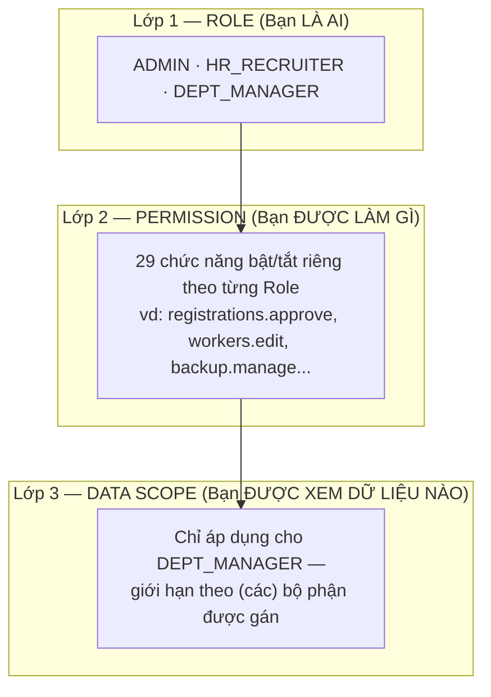

[← Mục lục](./README.md)

# 10. Permissions & Data Scope

Đây là phần **quan trọng nhất** để hiểu "vì sao tôi thấy/không thấy cái này". Hệ thống phân quyền theo **3 lớp độc lập**, không phải 1 lớp duy nhất:

## 10.1 Lớp 1 — Role (Bạn là ai)

3 vai trò cố định: `ADMIN`, `HR_RECRUITER`, `DEPT_MANAGER`. Vai trò quyết định **về tổng thể** bạn thuộc nhóm nào và thấy nhóm menu nào trên Sidebar — xem bảng chi tiết ở [Phụ lục — Role matrix](./23-appendix.md#role-matrix).

## 10.2 Lớp 2 — Permission (Bạn được làm gì)

Trên nền vai trò, hệ thống có **29 quyền chi tiết** (ví dụ: *Duyệt/Từ chối hồ sơ*, *Sửa/Xoá DW Data*, *Backup dữ liệu*, *Xem CCCD khi Export*...), mỗi quyền bật/tắt **độc lập cho từng vai trò** tại **Phân quyền chi tiết** (`/admin/permissions`).

- **Mặc định** (chưa từng cấu hình) = **cho phép** — Admin không cần bật tay từng ô, hệ thống hoạt động đầy đủ ngay từ đầu.
- Admin **tắt** một ô cụ thể để **chặn thêm** một chức năng cho một vai trò — ví dụ tắt "Tạo yêu cầu Nghỉ việc/Thuyên chuyển" cho `DEPT_MANAGER` nếu công ty muốn chỉ HR mới được tạo yêu cầu, quản đốc chỉ được xem.
- Danh sách đầy đủ 29 quyền: [Phụ lục — Permission overview](./23-appendix.md#permission-overview).

> **Lưu ý:** Permission là lớp **bổ sung**, không thay thế Role. Một quyền bị tắt chỉ chặn đúng thao tác đó cho đúng vai trò đó — không ảnh hưởng tới các vai trò khác hay các quyền khác.

## 10.3 Lớp 3 — Data Scope (Bạn được xem dữ liệu nào)

Data Scope trả lời câu hỏi **"được thao tác Ở ĐÂU"** — tách biệt hoàn toàn khỏi Role và Permission.

- `ADMIN` và `HR_RECRUITER`: **luôn xem toàn bộ**, không cần cấu hình gì.
- `DEPT_MANAGER`: **chỉ xem được (các) bộ phận được gán riêng** tại **Data Scope** (`/admin/data-scopes`). Một Quản đốc có thể được gán **nhiều bộ phận cùng lúc**.

**Ví dụ cụ thể:** Một tài khoản có vai trò `DEPT_MANAGER` nhưng chỉ được gán **Packing – A** và **Packing – B** tại Data Scope thì **không thể xem được dữ liệu của Cẩm Chướng** — dù họ có đầy đủ quyền `DEPT_MANAGER` thông thường. Đây không phải lỗi hệ thống, mà đúng theo thiết kế.

Data Scope ảnh hưởng tới hầu hết màn hình: "Bộ phận của tôi", Task Center, Daily Application (khi xem theo bộ phận), Workforce Movement, Planning...

> **Quan trọng:** Nếu một tài khoản `DEPT_MANAGER` chưa được gán bộ phận nào ở Data Scope, một số màn hình sẽ hiện **danh sách trống** hoặc thông báo "chưa được gán bộ phận nào" — đây là hành vi **an toàn theo mặc định** (không gán = không xem được gì), không phải lỗi.

## 10.4 Vì sao tôi không thấy một menu/nút nào đó?

Kiểm tra theo đúng thứ tự 3 lớp:

1. **Role** — menu đó có thuộc nhóm dành cho vai trò của bạn không? (xem [Role matrix](./23-appendix.md#role-matrix))
2. **Permission** — quyền tương ứng có đang bị Admin tắt cho vai trò của bạn không? (kiểm tra tại Phân quyền chi tiết)
3. **Data Scope** — nếu bạn là Quản đốc bộ phận, dữ liệu bạn cần tìm có thuộc bộ phận được gán cho bạn không?

Tiếp theo: [11 — Import / Export](./11-import-export.md)
