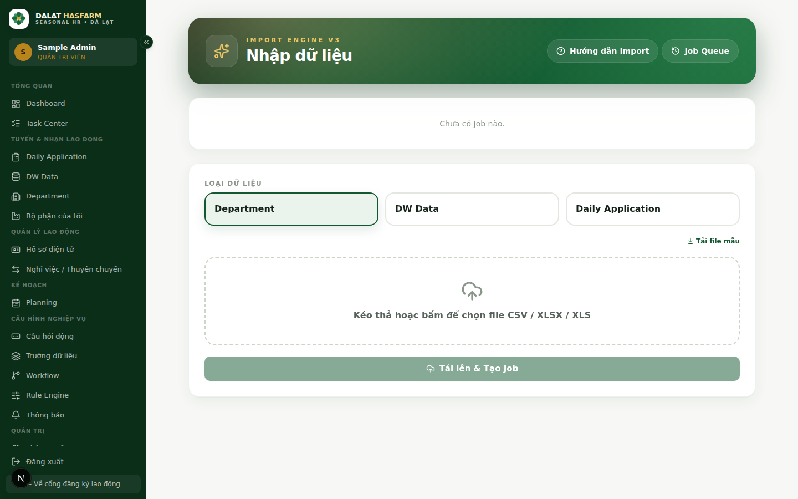

[← Mục lục](./README.md)

# 11. Import / Export

## 11.1 Import dữ liệu

**Ai dùng:** chỉ `ADMIN`. Vào Sidebar → **Nhập dữ liệu ban đầu**.

### File nào được import?

3 loại dữ liệu: **Department** (bộ phận), **DW Data** (kho lao động gốc), **Daily Application** (đơn đăng ký). Chọn đúng loại trước khi tải file lên.

### Định dạng

Chấp nhận **CSV, XLSX, XLS**. Bấm **"Tải file mẫu"** để lấy đúng cấu trúc cột trước khi chuẩn bị dữ liệu.

### Alias (tên cột thay thế)

Nếu file của bạn dùng tên cột khác chuẩn (ví dụ file cũ ghi "Phone" thay vì "SĐT"), hệ thống vẫn nhận diện được nhờ **Alias** — danh sách tên gọi khác được Admin khai báo sẵn cho từng trường tại [Trường dữ liệu (Metadata)](./09-admin-modules.md#trường-dữ-liệu-metadata). Nếu file bị báo "không nhận diện được cột", kiểm tra và bổ sung alias tương ứng trước khi import lại.

### Các bước xử lý của một Job Import

Sau khi tải file lên, hệ thống xử lý tuần tự theo 5 bước, chạy nền (bạn có thể đóng trang, quay lại sau để xem tiến trình):

1. **STAGING** — nạp toàn bộ dòng dữ liệu thô vào hệ thống.
2. **VALIDATING** — kiểm tra định dạng từng dòng, đánh dấu dòng lỗi/cảnh báo.
3. **MATCHING** — (chỉ với Daily Application) đối chiếu với DW Data để xác định cũ/mới.
4. **MERGING** — ghi chính thức vào dữ liệu hệ thống.
5. **BUILDING_STATS** — tổng hợp số liệu cuối cùng.

### Đọc kết quả Job

| Chỉ số | Ý nghĩa |
|---|---|
| Tổng dòng | Tổng số dòng trong file |
| Đã thêm mới | Số bản ghi hoàn toàn mới |
| Đã cập nhật | Số bản ghi đã có, được cập nhật thông tin |
| Trùng lặp | Số dòng bị bỏ qua vì đã tồn tại giống hệt |
| Cảnh báo | Dòng import được nhưng có điểm cần chú ý |
| Lỗi | Dòng không import được — xem log job để biết lý do cụ thể từng dòng |

> **Mẹo:** Nếu tải nhầm đúng file đã import trước đó (checksum trùng), hệ thống sẽ cảnh báo tránh việc bạn vô tình import trùng dữ liệu 2 lần.

> **Lưu ý:** Nếu một Job bị treo do sự cố mạng/máy chủ, hệ thống có một tác vụ nền tự kiểm tra và khôi phục Job — bạn không cần tự huỷ và làm lại ngay lập tức, hãy đợi vài phút và kiểm tra lại trạng thái Job trước.

## 11.2 Export dữ liệu

Nút **"Xuất Excel"** có ở Daily Application, "Bộ phận của tôi", và một số màn hình khác — luôn xuất **theo đúng khoảng ngày và bộ phận đang chọn**, không phải toàn bộ dữ liệu hệ thống. Các bộ lọc khác trên màn hình (Trạng thái, DW Data, từ khoá tìm kiếm) **không** được mang theo khi xuất — xem lưu ý chi tiết ở [chương 4](./04-daily-application.md#48-xuất-excel).

### Che thông tin cá nhân khi xuất Excel

> **Quan trọng:** CCCD, Số điện thoại, Địa chỉ khi xuất Excel **có thể bị che (mask)** tuỳ theo quyền của vai trò bạn đang dùng:

| Quyền | Nếu **được phép** | Nếu **không được phép** |
|---|---|---|
| `privacy.view_cccd` | CCCD xuất đầy đủ | Hiện `•••• (ẩn theo quyền)` |
| `privacy.view_phone` | SĐT xuất đầy đủ | Hiện `•••• (ẩn theo quyền)` |
| `privacy.view_address` | Địa chỉ xuất đầy đủ | Hiện `•••• (ẩn theo quyền)` |

3 quyền này cấu hình tại [Phân quyền chi tiết](./09-admin-modules.md) — mặc định **cho phép** cho tới khi Admin chủ động tắt.

> **Quan trọng:** Việc che thông tin chỉ áp dụng cho **file xuất ra**. Nếu bạn cần một bản ghi CCCD/SĐT/Địa chỉ đầy đủ, hãy vào đúng hồ sơ trên hệ thống thay vì tìm cách "gỡ mask" trên file Excel — không có thao tác nào trên giao diện được thiết kế để bỏ qua quy tắc che thông tin này.

Tiếp theo: [12 — Backup](./12-backup.md)
