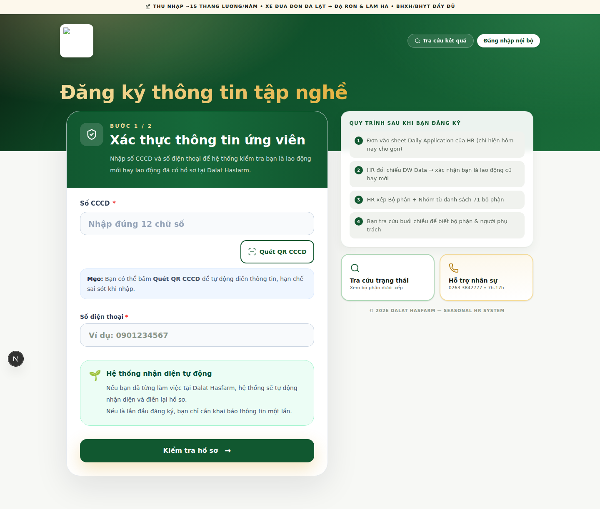
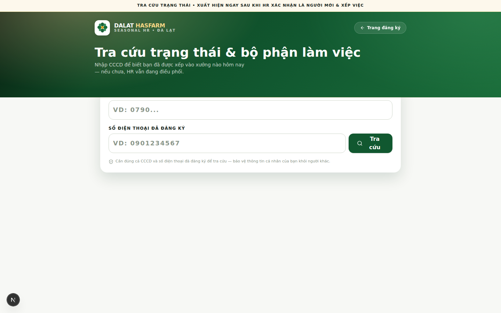
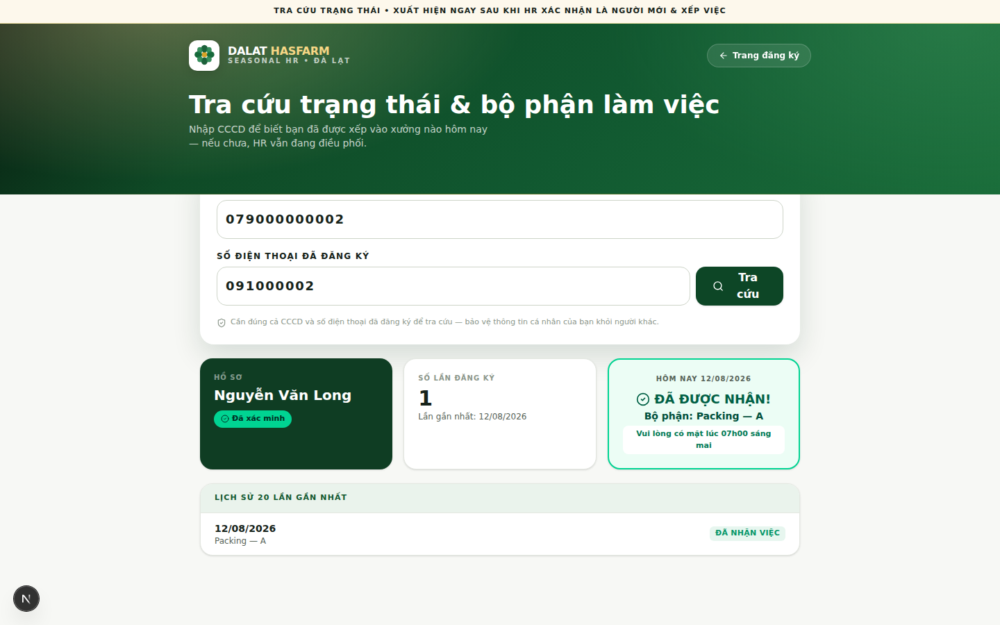
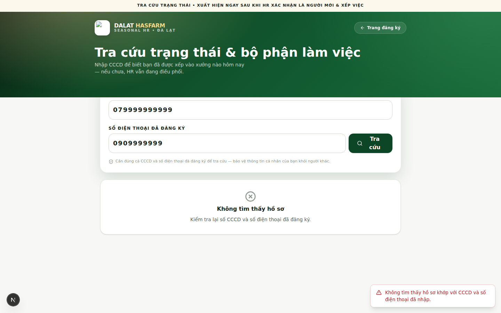

[← Mục lục](./README.md)

# 13. Tra cứu công khai (Public Lookup)

Đây là trang **dành cho người lao động**, không cần tài khoản đăng nhập. Có 2 trang công khai: **Trang đăng ký** (nộp đơn) và **Trang tra cứu** (xem kết quả).

## 13.1 Trang đăng ký

Trang chủ hệ thống (`/`) — nơi người lao động tự đăng ký thông tin tập nghề.

1. Nhập **Số CCCD** (bắt buộc, đúng 12 chữ số) và **Số điện thoại**.
2. Có thể bấm **"Quét QR CCCD"** để tự động điền thông tin từ mã QR trên thẻ CCCD, hạn chế gõ tay sai sót.
3. Hệ thống tự kiểm tra: nếu bạn đã từng làm việc tại Dalat Hasfarm, thông tin sẽ **tự động nhận diện và điền lại hồ sơ cũ** — không phải khai lại từ đầu; nếu là lần đầu, bạn cần khai đầy đủ các câu hỏi bắt buộc (Giới tính, Dân tộc, Thời gian đăng ký làm, Kênh giới thiệu, và cam kết thông tin chính xác).
4. Nộp đơn.

> **Lưu ý:** Mỗi số CCCD chỉ được đăng ký **1 lần trong cùng 1 ngày**. Đăng ký lần thứ hai trong ngày sẽ báo "Đã xác nhận đăng ký hôm nay" — đây không phải lỗi, đăng ký đầu tiên trong ngày đã được ghi nhận.

## 13.2 Trang tra cứu kết quả

Vào `/lookup` (hoặc bấm **"Tra cứu kết quả"** từ trang đăng ký).

1. Nhập **Số CCCD** đã dùng để đăng ký.
2. Nhập **Số điện thoại đã đăng ký**.
3. Bấm **Tra cứu**.

### Kết quả tìm thấy

Hiện: hồ sơ đã xác minh hay chưa, tổng số lần đăng ký, và kết quả **hôm nay** — nếu đã được nhận, hệ thống hiện rõ **bộ phận được xếp** và giờ hẹn có mặt.

### Không tìm thấy kết quả

## 13.3 Vì sao cần cả CCCD lẫn số điện thoại?

> **Quan trọng:** Hệ thống yêu cầu nhập **đúng cả hai** thông tin (CCCD + số điện thoại đã đăng ký) mới cho xem kết quả — đây là cơ chế **xác minh 2 yếu tố** để bảo vệ thông tin cá nhân của bạn khỏi bị người khác dò xem bằng cách chỉ cần biết số CCCD. Trang tra cứu này **không hiển thị bất kỳ dữ liệu nội bộ nào khác** (không có tên bộ phận đầy đủ danh sách, không có thông tin lao động khác, không có dữ liệu quản trị).

Nếu bạn chắc chắn cả hai thông tin đều đúng mà vẫn báo "Không tìm thấy hồ sơ", có thể do:
- CCCD hoặc số điện thoại gõ sai khi đăng ký ban đầu — liên hệ HR để kiểm tra và sửa lại.
- Hồ sơ vừa nộp chưa được hệ thống xử lý xong (hiếm khi xảy ra, đợi vài phút và thử lại).

Tiếp theo: [14 — Hướng dẫn dùng trên điện thoại](./14-mobile-guide.md)
