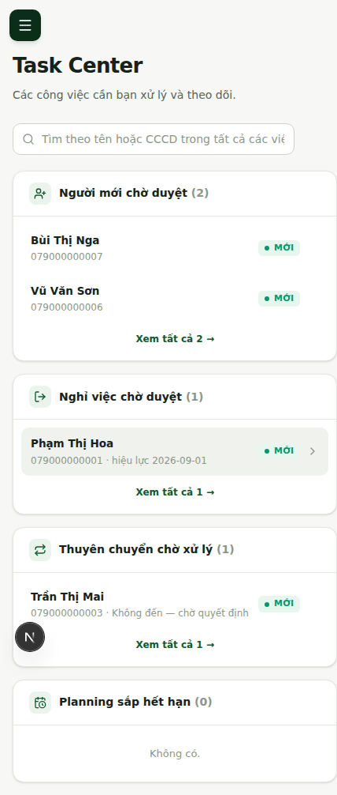
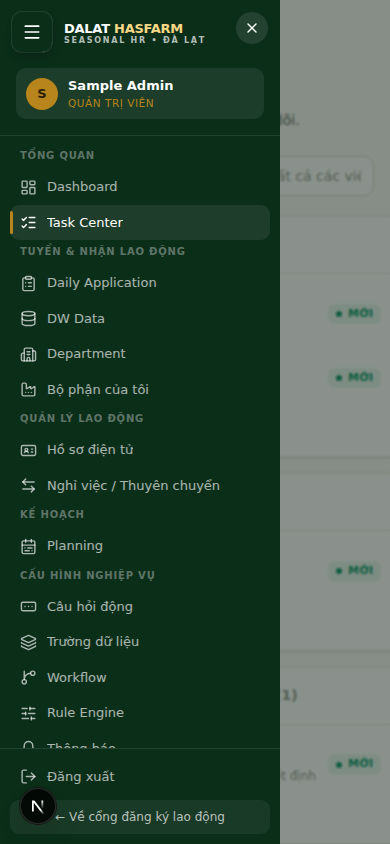
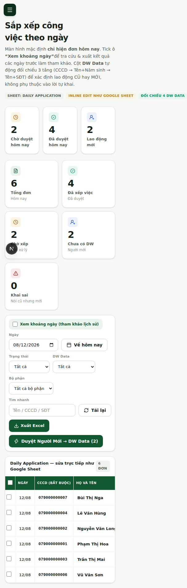
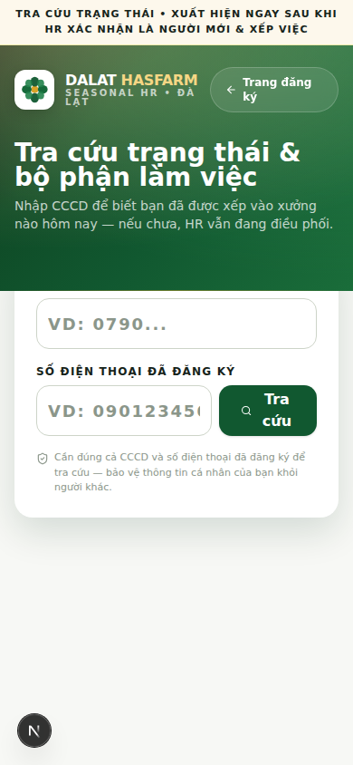
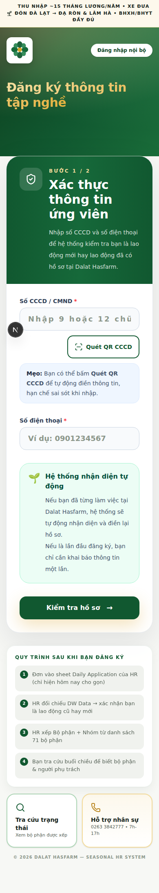

[← Mục lục](./README.md)

# 14. Hướng dẫn dùng trên điện thoại

Hệ thống hoạt động tốt trên điện thoại (đã kiểm tra ở độ rộng 390px — kích thước phổ biến của điện thoại thông thường). Một số thao tác có khác biệt nhỏ so với máy tính.

## 14.1 Mở menu điều hướng

Trên di động, Sidebar được ẩn thành **menu trượt (drawer)**. Bấm nút ☰ ở góc trên-trái để mở, bấm dấu ✕ hoặc chạm ra ngoài để đóng.

<table><tr>
<td></td>
<td></td>
</tr></table>

## 14.2 Cuộn bảng dữ liệu

Các bảng nhiều cột (Daily Application, Department...) sẽ **cuộn ngang** trên màn hình hẹp thay vì bị vỡ layout hay ẩn bớt cột. Vuốt sang trái/phải trên bảng để xem hết các cột.

> **Lưu ý:** Không có cột dữ liệu nghiệp vụ nào bị ẩn đi trên di động để "cho gọn" — mọi thông tin đều xem được, chỉ khác cách cuộn.

## 14.3 Thao tác Task Center trên di động

Task Center hiển thị các thẻ nhóm việc xếp chồng theo chiều dọc thay vì 2 cột như trên máy tính — thao tác tìm kiếm, xem chi tiết, bấm "Xem tất cả" hoạt động giống hệt bản desktop.

## 14.4 Tra cứu công khai trên di động

Trang tra cứu và trang đăng ký công khai được thiết kế ưu tiên cho di động (nhiều người lao động dùng điện thoại là chính) — form nhập liệu lớn, dễ chạm, không cần zoom.

<table><tr>
<td></td>
<td></td>
</tr></table>

Tiếp theo: [15 — Thói quen làm việc hiệu quả](./15-best-practices.md)
