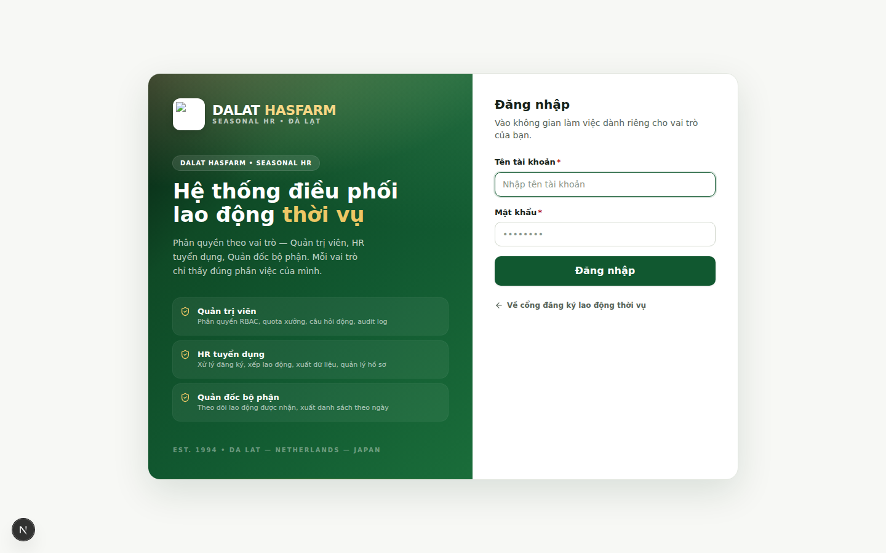

<p align="center">
  
</p>

<h1 align="center">SEASONAL WORKER</h1>
<p align="center"><b>Hướng dẫn sử dụng hệ thống quản lý lao động thời vụ</b></p>
<p align="center">Dành cho HR Tuyển dụng, Quản lý bộ phận và Quản trị hệ thống — Dalat Hasfarm</p>

<p align="center">
  <sub>Phiên bản tài liệu 1.0 · Cập nhật lần cuối: 12/08/2026 · Dựa trên mã nguồn nhánh <code>main</code></sub>
</p>

---

## Đây là tài liệu gì?

Đây là **cẩm nang sử dụng** hệ thống Seasonal Worker — không phải tài liệu kỹ thuật cho lập trình viên. Mọi mô tả trong tài liệu này đều được đối chiếu trực tiếp với giao diện và mã nguồn thật của hệ thống tại thời điểm viết, không có tính năng nào được "vẽ thêm".

Nếu bạn mới bắt đầu, hãy đọc **[Bắt đầu trong 5 phút](./00-quick-start.md)** trước tiên.

## Mục lục

### Bắt đầu
- **[00 — Bắt đầu trong 5 phút](./00-quick-start.md)**
- **[01 — Giới thiệu hệ thống](./01-gioi-thieu.md)** — Seasonal Worker là gì, ai dùng, luồng nghiệp vụ tổng thể
- **[02 — Đăng nhập & giao diện chung](./02-dang-nhap-giao-dien.md)** — đăng nhập, Sidebar, Header

### Nghiệp vụ hàng ngày
- **[03 — Task Center](./03-task-center.md)** ⭐ nơi bắt đầu mỗi ngày làm việc
- **[04 — Daily Application](./04-daily-application.md)** — tiếp nhận, duyệt, xếp bộ phận
- **[05 — DW Data / Worker Profile](./05-dw-data-worker-profile.md)** — hồ sơ điện tử người lao động
- **[06 — Department](./06-department.md)** — quản lý bộ phận (Admin) & "Bộ phận của tôi" (Manager)
- **[07 — Planning](./07-planning.md)** — kế hoạch nhân lực theo giai đoạn
- **[08 — Workforce Movement](./08-workforce-movement.md)** — nghỉ việc & thuyên chuyển

### Quản trị hệ thống
- **[09 — Các module Admin](./09-admin-modules.md)** — Users, Form Builder, Field Definitions, Workflow, Rule Engine, Notifications, System Control Center, Audit Log
- **[10 — Permissions & Data Scope](./10-permissions-data-scope.md)** — mô hình 3 lớp phân quyền
- **[11 — Import / Export](./11-import-export.md)**
- **[12 — Backup](./12-backup.md)**

### Dành cho người ngoài hệ thống
- **[13 — Tra cứu công khai (Public Lookup)](./13-public-lookup.md)**

### Tham khảo nhanh
- **[14 — Hướng dẫn dùng trên điện thoại](./14-mobile-guide.md)**
- **[15 — Thói quen làm việc hiệu quả](./15-best-practices.md)**
- **[16 — Lỗi thường gặp khi thao tác](./16-common-mistakes.md)**
- **[17 — Xử lý sự cố (Troubleshooting)](./17-troubleshooting.md)**
- **[18 — Câu hỏi thường gặp (FAQ)](./18-faq.md)**
- **[19 — Thuật ngữ (Glossary)](./19-glossary.md)**
- **[20 — Quy trình xử lý tình huống (SOP)](./20-sop.md)**
- **[21 — Nên làm / Không nên làm theo vai trò](./21-do-dont.md)**
- **[22 — Checklist vận hành](./22-checklists.md)**
- **[23 — Phụ lục tham chiếu nhanh](./23-appendix.md)**

### Cheat sheet theo vai trò
- **[role-hr.md](./role-hr.md)** — HR Tuyển dụng: tôi cần làm gì mỗi ngày?
- **[role-manager.md](./role-manager.md)** — Quản lý bộ phận: tôi cần làm gì mỗi ngày?
- **[role-admin.md](./role-admin.md)** — Admin: tôi cần kiểm tra gì định kỳ?

---

## Ba vai trò trong hệ thống

| Vai trò | Tên trong hệ thống | Công việc chính |
|---|---|---|
| **Quản trị viên** | `ADMIN` | Quản trị toàn hệ thống: tài khoản, phân quyền, cấu hình nghiệp vụ, backup, theo dõi audit log |
| **Nhân sự tuyển dụng** | `HR_RECRUITER` | Tiếp nhận & duyệt hồ sơ, xếp bộ phận, quản lý Planning, xử lý Nghỉ việc/Thuyên chuyển |
| **Quản đốc bộ phận** | `DEPT_MANAGER` | Theo dõi lao động thuộc bộ phận được phân công, tạo yêu cầu nghỉ việc/thuyên chuyển |

Quyền hạn thực tế của mỗi vai trò còn phụ thuộc vào **Phân quyền chi tiết** và **Data Scope** do Admin cấu hình — xem chi tiết ở [chương 10](./10-permissions-data-scope.md). Vì vậy hai người cùng vai trò `DEPT_MANAGER` vẫn có thể thấy quyền và dữ liệu khác nhau.

## Định dạng tài liệu

- **Markdown** (`.md`) — nguồn chính, dễ đọc trực tiếp trên GitHub, dễ cập nhật khi giao diện thay đổi.
- **[handbook.html](./handbook.html)** — bản gộp toàn bộ tài liệu thành 1 trang, có thể mở bằng trình duyệt và **in ra PDF** (File → Print → Save as PDF) mà không cần cài thêm phần mềm.
- **[CHANGELOG.md](./CHANGELOG.md)** — lịch sử cập nhật tài liệu theo từng phiên bản hệ thống.

### Cập nhật `handbook.html` sau khi sửa nội dung `.md`

`handbook.html` là **bản build**, không sửa tay trực tiếp — sửa các file `.md` tương ứng rồi build lại:

```bash
npm install --no-save marked          # chỉ cần chạy 1 lần
node scripts/build-user-guide.mjs
```

Nếu bạn sửa hoặc thêm sơ đồ (```mermaid` trong các file `.md`), cập nhật đồng thời mã nguồn sơ đồ trong `scripts/render-user-guide-diagrams.mjs` rồi chạy:

```bash
npm install --no-save mermaid playwright-core   # chỉ cần chạy 1 lần
node scripts/render-user-guide-diagrams.mjs
node scripts/build-user-guide.mjs
```

Hai lệnh `npm install --no-save` ở trên **không đụng tới** `package.json`/`package-lock.json` của ứng dụng — chỉ cài tạm cho máy đang chạy script build tài liệu.

## Quy ước trong tài liệu

> **Mẹo:** Gợi ý giúp bạn thao tác nhanh hơn.

> **Lưu ý:** Thông tin cần chú ý nhưng không gây hậu quả nghiêm trọng nếu bỏ qua.

> **Quan trọng:** Cảnh báo — bỏ qua có thể gây sai dữ liệu hoặc ảnh hưởng người khác.

Ảnh chụp màn hình trong tài liệu dùng **dữ liệu demo** (tên, CCCD, số điện thoại đều là dữ liệu giả lập tạo riêng để minh hoạ) — không phải dữ liệu lao động thật. Giao diện thật có thể thay đổi nhẹ theo các bản cập nhật sau này.
